# Chapter 3 — System Design (SchoGMS)

**Scholarship and Grants Management System (SchoGMS)**  
Sultan Kudarat State University (SKSU) — institutional scholarship operations  

*This section is prepared for direct inclusion in a research manuscript. Renumber section and figure identifiers (e.g., 3.3, Figure 3-1) to match your institutional thesis template.*

**Implementation scope note:** The deployed SchoGMS supports **staff-operated** scholarship workflows. Beneficiaries (TDP/TES scholars) are managed as database records imported from CHED masterlists; **student and guardian login portals are not implemented** in the current version. Where the literature refers to “scholarship application,” this documentation maps that concept to **institutional masterlist registration and validation**, which is what the system actually performs.

---

## 3.3 System Design

The system design of SchoGMS describes **what** the system is structurally and **how** its components, data, and users interact to support scholarship and grant management across SKSU campuses. Design artifacts include architectural views, functional use cases, data flow models, a conceptual database schema, behavioral diagrams (activity, sequence, and state), and a deployment model. All diagrams and narratives below were derived from the implemented PHP/MySQL application under `users/`, `admin/`, and shared configuration modules, and were verified against the live database schema (fourteen core tables).

The design emphasizes **role-based access**, **campus-scoped data**, **document-driven compliance** (Certificate of Registration and Certificate of Grades), **cross-validation** between CHED and registrar records, and **formal approval** of Annex 7 utilization reports by the scholarship chairman. Email-based verification acts as a second authentication factor for newly provisioned accounts. Together, these elements define a centralized web system that replaces fragmented manual processes with auditable digital workflows.

---

## 3.3.1 System Architecture and Functional Design

**Recommended figures (easiest to read):** Open **[schogms-architecture-functional.html](./schogms-architecture-functional.html)** in a browser and export to PDF. Full Mermaid code and tables: **[SchoGMS_Architecture_Functional_Design.md](./SchoGMS_Architecture_Functional_Design.md)**.

### System architecture — description

The system architecture diagram presents SchoGMS as a **layered, multi-portal web application**. Layer 1 (presentation) includes the public login and verification pages, the administrator portal (`admin/`), and seven staff portals under `users/`—coordinator, chairman, registrar, director, dean, and program chair. Layer 2 (application) implements authentication with email verification, campus-scoped sessions, CHED masterlist import, COR/COG handling, validation, Annex 7 approval, and email notifications in PHP. Layer 3 (data) stores structured records in **MySQL** (fourteen tables) and documents on **server file storage**. An external **SMTP** service delivers verification codes and approval messages.

### System architecture — meaning

The diagram shows **where each role enters the system** and how all portals share one application core and one database. SchoGMS is deployed as a **LAMP-style** solution (Apache, PHP, MySQL) suitable for XAMPP development or institutional hosting—not a mobile app or microservice cluster.

### Functional design — description

Functional design organizes SchoGMS into **eight modules**: (A) authentication and two-factor email verification; (B) user and campus administration; (C) CHED TDP/TES masterlists; (D) registrar data and COR/COG documents; (E) validation and compliance; (F) Annex 7 submission with chairman approval or rejection; (G) campus hierarchy assignments; and (H) reporting and dashboards. The main pipeline runs **B/A → C → D → E → F → H**; module G operates in parallel for directors, deans, and program chairs.

### Functional design — meaning

Readers distinguish **technology layers** (architecture) from **business capabilities** (functions). Each function maps to real pages and tables in the implemented project, which supports traceability in the research document.

### Figure captions

*Figure 3-1a. Layered system architecture of the SchoGMS showing presentation portals, application modules, data stores, and SMTP email service.*

*Figure 3-1b. Functional design of the SchoGMS showing eight modules (A–H) and the scholarship operations pipeline.*

### Diagram code — architecture (layered)

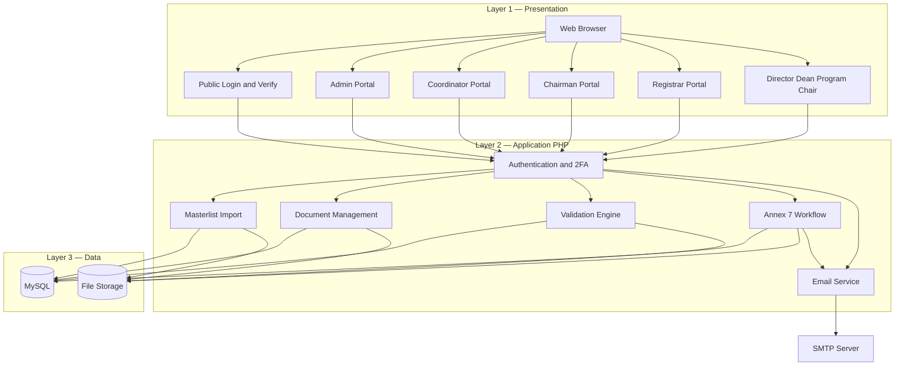

### Diagram code — functional design (modules + pipeline)

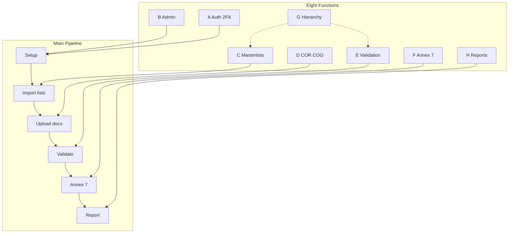

### Screenshot / export notes

| Output | Source |
|--------|--------|
| Best architecture + functional figure | `schogms-architecture-functional.html` → Print to PDF |
| Mermaid only | `SchoGMS_Architecture_Functional_Design.md` |
| UI evidence (optional) | Sidebars: coordinator, chairman, registrar dashboards |

---

## 3.3.2 Use Case Diagram

### Description

The use case diagram summarizes **functional capabilities** of SchoGMS and the **operational roles** authorized to perform them. Seven actors represent implemented login roles: System Administrator, Chairman, Scholarship Coordinator, Registrar, Campus Director, College Dean, and Program Chair. Eight use cases group related features: user and campus administration, authenticated access with email verification, CHED beneficiary list management, document upload and tracking, record validation, Annex 7 submission and approval, campus leadership assignment, and report generation.

### Meaning of the diagram

The diagram answers the question, *Who may do what within SchoGMS?* It establishes the functional boundary of the system and supports traceability from requirements to modules (e.g., coordinator validation maps to the validation use case). It also makes explicit that **scholar self-service application** is outside the current system boundary; beneficiaries enter the system only through staff-driven masterlist import.

### Figure caption

*Figure 3-2. Use case diagram of the SchoGMS illustrating role-based access to major system functions.*

### Diagram code

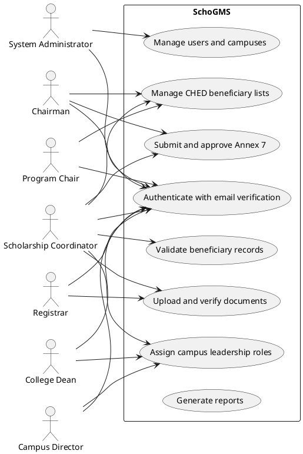

---

## 3.3.3 Context Diagram

### Description

The context diagram places SchoGMS at the center of its environment and shows **external entities** that exchange information with the system. The administrator configures users and campuses. Scholarship offices (coordinator, chairman, and related staff) conduct daily operations. CHED or institutional data files supply beneficiary rosters through import. The system maintains internal **records** (relational data) and **documents** (uploaded files).

### Meaning of the diagram

This diagram defines the **system boundary**: processes inside the boundary are implemented in SchoGMS; entities outside supply inputs or receive outputs. It is appropriate for Chapter 3 because it precedes detailed decomposition (data flow and database design) and anchors the study in a real institutional setting without prematurely exposing internal processes.

### Figure caption

*Figure 3-3. Context diagram of the SchoGMS showing external entities and the system boundary.*

### Diagram code

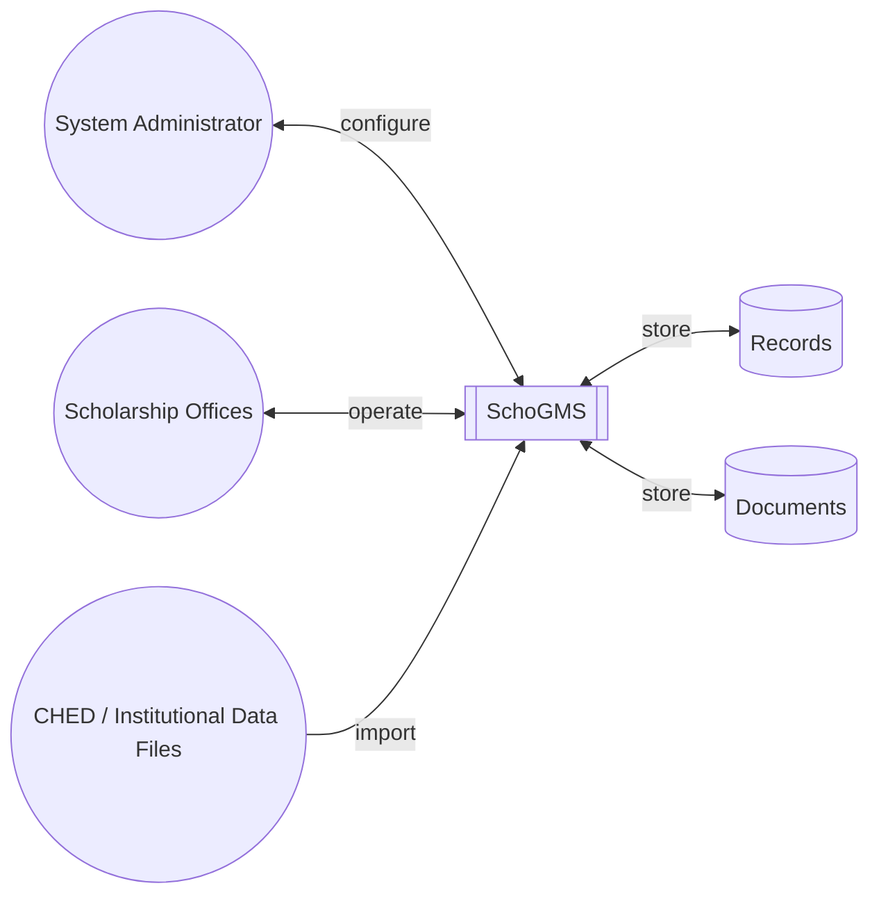

---

## 3.3.4 Data Flow Diagrams

Data flow modeling describes how information moves through SchoGMS. The **context diagram** (Section 3.3.3) establishes external entities. The **Level 0 diagram** treats the entire system as a single process. The **Level 1 diagram** decomposes that process into five sub-processes aligned with implemented modules.

### Level 0 Data Flow Diagram

#### Description

At Level 0, all internal processing is represented by one process, **SchoGMS (0)**, interacting with two external entities—**Institutional Users** and **Administrator**—and three logical data stores: user and campus data, scholarship records, and uploaded files.

#### Meaning

Level 0 emphasizes inputs (configuration, credentials, masterlists, documents) and outputs (reports, statuses, notifications) without detailing internal modules. It is suitable for a high-level thesis overview before Level 1 refinement.

#### Figure caption

*Figure 3-4. Level 0 data flow diagram of the SchoGMS.*

#### Diagram code

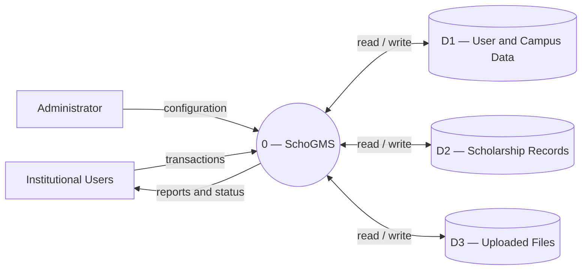

---

### Level 1 Data Flow Diagram

#### Description

Level 1 decomposes SchoGMS into five processes: **(1.0) Authenticate and Verify**, **(2.0) Manage Masterlists**, **(3.0) Manage Documents**, **(4.0) Validate Records**, and **(5.0) Approve Reports and Notify**. Process 4.0 reads from both masterlist and document stores; process 5.0 updates submission records and may send email to users.

#### Meaning

The Level 1 diagram bridges architecture and database design by showing **which data stores each process consumes or updates**. It supports discussion of data dependencies—for example, validation cannot be completed until both beneficiary masterlists and COR/COG metadata exist.

#### Figure caption

*Figure 3-5. Level 1 data flow diagram of the SchoGMS.*

#### Diagram code

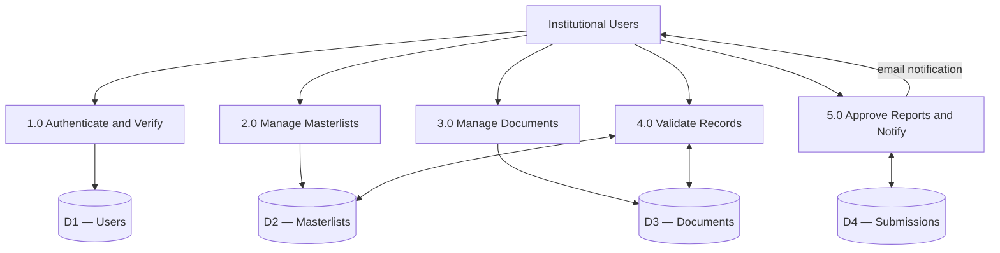

---

### Description of processes and data stores

| ID | Process | Description | Primary implementation |
|----|---------|-------------|----------------------|
| **1.0** | Authenticate and Verify | Validates credentials, enforces account status, and completes email verification (six-digit code) before dashboard access. | `login.php`, `verify.php`, `verify_code.php`, `config/mysql_auth.php` |
| **2.0** | Manage Masterlists | Imports and maintains CHED TDP/TES beneficiary rosters and registrar masterlist data per campus. | `process_excel.php`, `ched_masterlist`, `ched_masterlist_tes`, `registrar_master_list` |
| **3.0** | Manage Documents | Accepts COR/COG uploads, stores file paths and metadata, and supports document listing. | `document_uploads`, registrar/coordinator upload modules |
| **4.0** | Validate Records | Compares CHED entries with registrar records and document presence; assigns validation outcomes. | `validate.php`, `auto_validate_tdp.php`, `validation_status` |
| **5.0** | Approve Reports and Notify | Manages Annex 7 submission lifecycle (Pending, Approved, Rejected) and sends approval email. | `file_submissions`, `update_status.php`, `config/mail.php` |

| ID | Data store | Contents | Representative tables / storage |
|----|------------|----------|--------------------------------|
| **D1** | Users | Staff accounts, roles, campuses, verification fields, leadership assignments | `users`, `admin`, `assigned_dean`, `assigned_program_chairs`, `verification_attempts` |
| **D2** | Masterlists | Beneficiary demographic and enrollment fields; upload logs | `ched_masterlist`, `ched_masterlist_tes`, `registrar_master_list`, `ched_upload_log` |
| **D3** | Documents | COR/COG metadata and binary files on disk | `document_uploads`, `uploads/` directories |
| **D4** | Submissions | Formal campus reports awaiting chairman action | `file_submissions` |

---

## 3.3.5 Entity-Relationship Diagram

### Description of database entities

The SchoGMS database is organized around **campus-scoped scholarship operations**. Core entities include:

- **Campuses** — institutional sites served by the system (`campuses`).
- **Users** — operational accounts for coordinator, chairman, registrar, director, and related roles (`users`).
- **CHED masterlist** — TDP beneficiary records per campus/sheet (`ched_masterlist`), with a parallel structure for TES (`ched_masterlist_tes`).
- **Registrar master list** — enrollment and academic reference data used in validation (`registrar_master_list`).
- **Document uploads** — index of COR and COG files (`document_uploads`).
- **File submissions** — Annex 7 reports with approval status (`file_submissions`).
- **Assigned dean / program chair** — credentials for college- and program-level leadership (`assigned_dean`, `assigned_program_chairs`).
- **Verification attempts** — log of email verification tries (`verification_attempts`).
- **Colleges and courses** — catalog supporting campus hierarchy (`schogms_colleges`, `schogms_courses`).

### Explanation of relationships

Relationships are predominantly **logical** rather than fully enforced by foreign keys. Users are associated with a campus name. Masterlist and document entities are keyed by campus (or sheet name) so that coordinators see only their assigned scope. Validation **matches** beneficiary names in `ched_masterlist` to filenames in `document_uploads` and rows in `registrar_master_list` through application logic. Coordinators **submit** Annex 7 records stored in `file_submissions`, linked to user identity and campus. This model supports flexible imports while keeping queries campus-specific for data governance.

### Figure caption

*Figure 3-6. Conceptual entity-relationship diagram of core SchoGMS database entities.*

### Diagram code

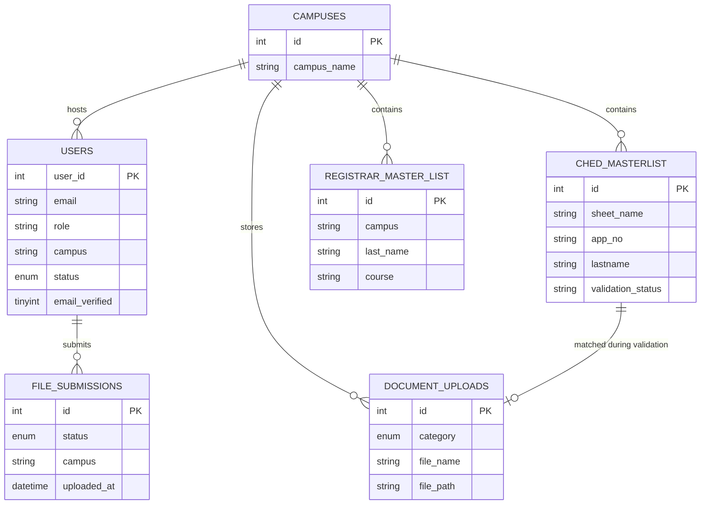

---

## 3.3.6 Activity Diagrams

Activity diagrams describe **behavioral workflows** from the user’s perspective. The following four diagrams correspond to authentication, beneficiary intake, compliance verification, and executive approval. A consolidated four-phase overview is also available in [schogms-activity-diagram.html](./schogms-activity-diagram.html) for presentation and printing.

---

### 3.3.6.1 Login and Two-Factor Authentication (Email Verification)

#### Description

Staff access begins at the login page. Valid credentials are checked against the `users` table (or leadership assignment tables for deans and program chairs). If the account is pending or not email-verified, the user is directed to the verification page to enter a **six-digit code** sent by email. Successful verification sets the account to active, clears the code, and allows session creation. Failed attempts may be logged in `verification_attempts`.

#### Meaning of the diagram

The diagram shows that authentication is **two-step** for new accounts: something the user knows (password) and something sent to a registered email (verification code). This reduces unauthorized access from mis-issued or mistyped accounts.

#### Figure caption

*Figure 3-7. Activity diagram of user login and email-based two-factor verification in the SchoGMS.*

#### Diagram code

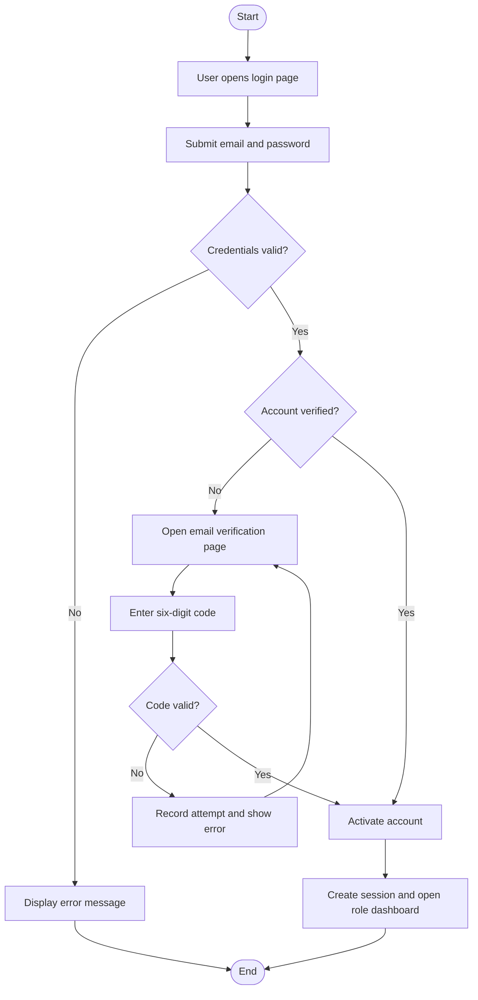

---

### 3.3.6.2 Scholarship Application (Beneficiary Registration)

#### Description

In SchoGMS, “application” is realized as **institutional registration of beneficiaries** rather than a student-completed web form. An authorized chairman or coordinator uploads a CHED-formatted Excel masterlist. The system parses rows, inserts records into `ched_masterlist` or `ched_masterlist_tes`, and may log summary statistics in `ched_upload_log`. Invalid files produce error feedback without persisting incomplete data.

#### Meaning of the diagram

The diagram clarifies for readers and panelists that the **implemented workflow** is bulk roster import aligned with CHED reporting practice, which is appropriate for TDP/TES administration but differs from generic “online scholarship application” portals.

#### Figure caption

*Figure 3-8. Activity diagram of beneficiary registration through CHED masterlist import in the SchoGMS.*

#### Diagram code

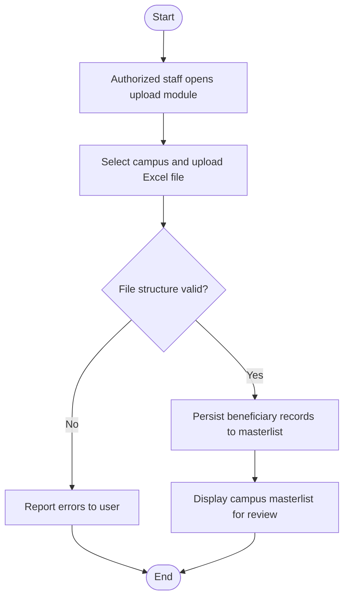

---

### 3.3.6.3 Requirements Upload and Verification

#### Description

Documentary requirements are satisfied when the **registrar** uploads Certificate of Registration (COR) and Certificate of Grades (COG) files. Metadata is stored in `document_uploads` and files are saved under campus-specific upload paths. The **scholarship coordinator** executes validation: comparing CHED masterlist fields with `registrar_master_list` and checking document availability. Outcomes are stored in `validation_status` (e.g., Validated, Failed) and may be exported through validation remark reports.

#### Meaning of the diagram

This workflow is central to **compliance**: scholarship eligibility is not approved on list import alone; the institution verifies enrollment evidence and document completeness before reporting.

#### Figure caption

*Figure 3-9. Activity diagram of document upload and beneficiary validation in the SchoGMS.*

#### Diagram code

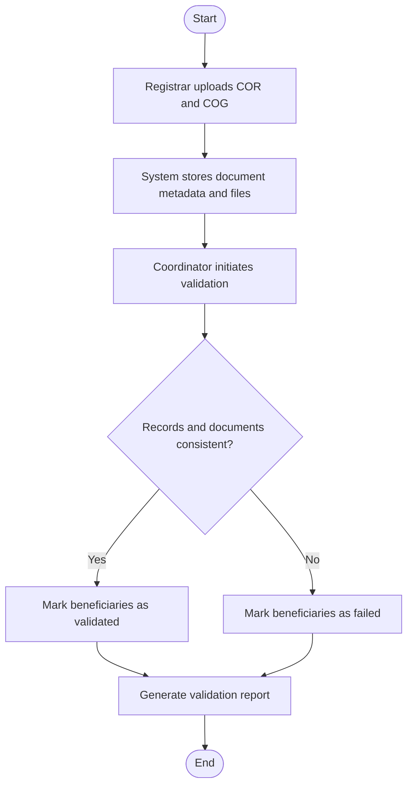

---

### 3.3.6.4 Review and Approval (Annex 7)

#### Description

After validation and internal reporting, the coordinator uploads the **Annex 7** campus utilization report. The system records the submission in `file_submissions` with status **Pending**. The chairman reviews the file (including in-system preview) and selects **Approved** or **Rejected**. Approval triggers an SMTP email to the coordinator; all statuses remain queryable for dashboards and audit.

#### Meaning of the diagram

The diagram captures the **executive control point** in the scholarship cycle: campus staff prepare data, but system-wide acceptance of the formal Annex 7 report rests with the chairman role.

#### Figure caption

*Figure 3-10. Activity diagram of Annex 7 review, approval, rejection, and notification in the SchoGMS.*

#### Diagram code

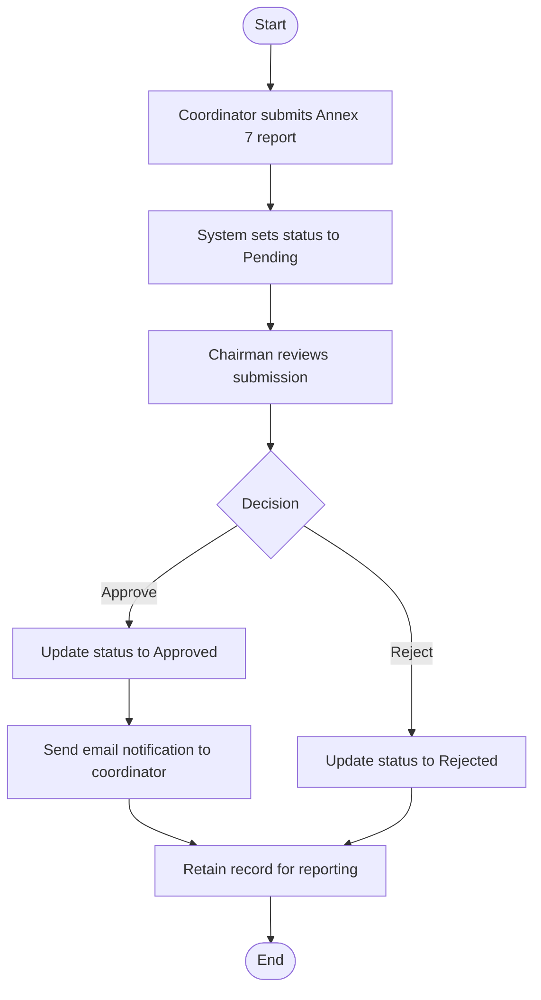

---

## 3.3.7 Sequence Diagrams

Sequence diagrams illustrate **temporal ordering** of interactions among actors and system components. Participant names are logical modules rather than every PHP filename, to preserve readability in the chapter.

---

### 3.3.7.1 Login and Two-Factor Authentication

#### Description

The user submits credentials through the web interface. The authentication module queries the database. If email verification is incomplete, control passes to the verification flow; upon success the module updates account fields and returns a session to the browser, which loads the role dashboard.

#### Meaning

Sequences complement activity diagrams by showing **request order** and **alternatives** (verified vs. not verified) at the message level.

#### Figure caption

*Figure 3-11. Sequence diagram of authentication and email verification in the SchoGMS.*

#### Diagram code

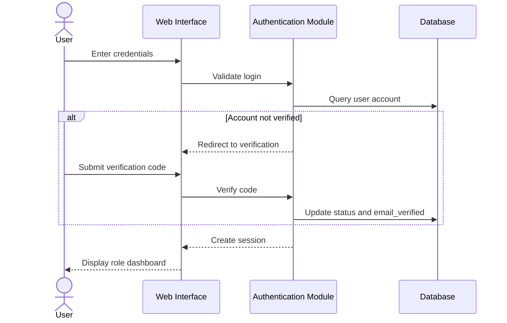

---

### 3.3.7.2 Application Submission (Masterlist Import)

#### Description

The chairman or coordinator selects a campus and uploads an Excel file. The upload handler validates structure, writes rows to the masterlist tables, and returns counts to the interface for user confirmation.

#### Meaning

This sequence formalizes **how beneficiary data enters** the system in time-ordered steps, supporting traceability from user action to persistence.

#### Figure caption

*Figure 3-12. Sequence diagram of CHED masterlist import representing beneficiary registration.*

#### Diagram code

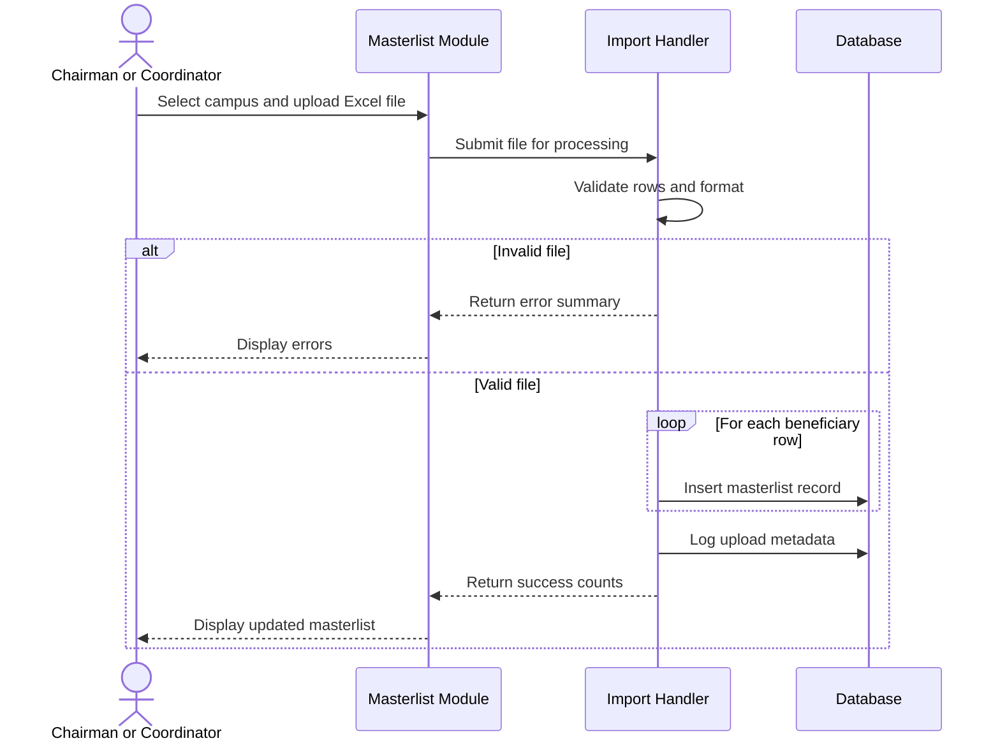

---

### 3.3.7.3 Requirements Review (Validation)

#### Description

The coordinator requests validation for a campus. The validation module loads CHED masterlist rows, registrar records, and document metadata, performs matching rules, updates `validation_status`, and returns results to the interface.

#### Figure caption

*Figure 3-13. Sequence diagram of coordinator-led beneficiary validation.*

#### Diagram code

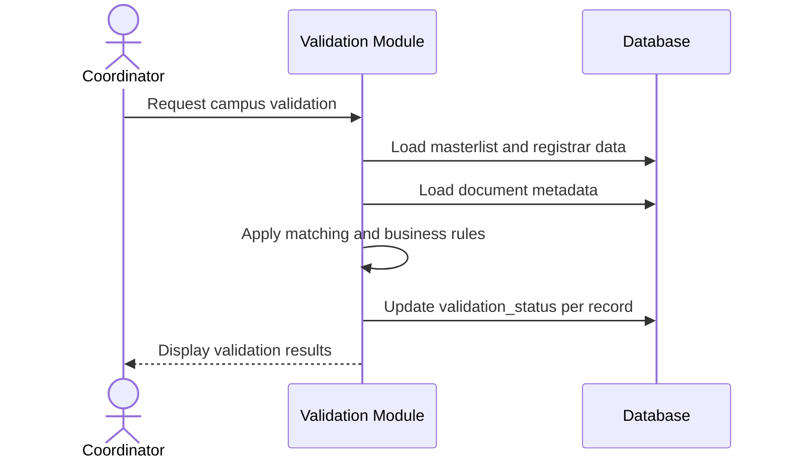

---

### 3.3.7.4 Approval Process (Annex 7)

#### Description

The chairman approves a pending Annex 7 submission. The review module updates `file_submissions`, invokes the email service, and confirms completion to the chairman while the coordinator receives notification.

#### Figure caption

*Figure 3-14. Sequence diagram of Annex 7 approval and email notification.*

#### Diagram code

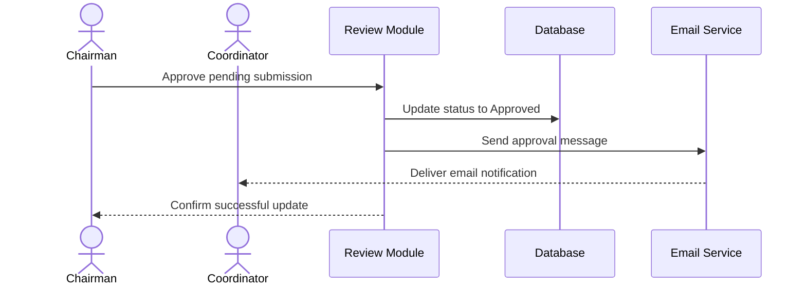

---

## 3.3.8 State Diagram — Scholarship Processing Status Lifecycle

### Description

SchoGMS does not use a single “application” table with one lifecycle. Instead, **three coordinated state models** describe progress: (1) **user account** status for staff access; (2) **Annex 7 submission** status for formal campus reporting; and (3) **TDP validation** status for beneficiary compliance. Together they represent the scholarship processing lifecycle in the implemented system.

### Meaning of the diagram

The diagram prevents misinterpretation that scholars “apply” through status transitions on one entity. It shows parallel state machines that map to real columns and enums in the database.

### Figure caption

*Figure 3-15. State diagram of user account, Annex 7 submission, and beneficiary validation statuses in the SchoGMS.*

### Diagram code

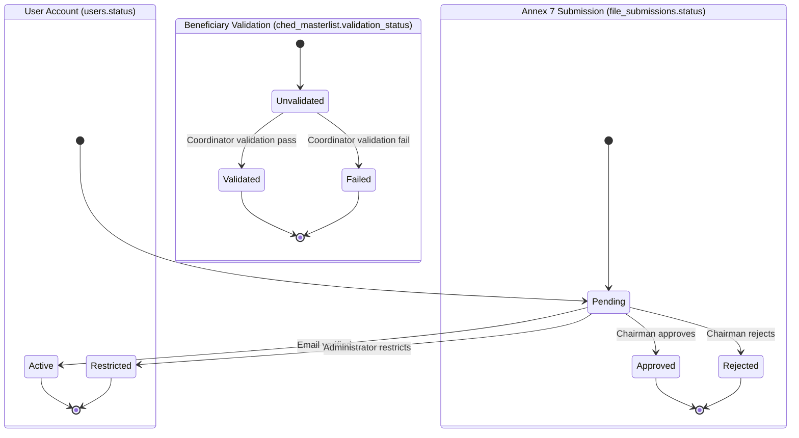

---

## 3.3.9 Deployment Diagram

### Description

The deployment diagram shows how SchoGMS is hosted in a typical **institutional or development environment**. End users interact through a **web browser**. Requests are handled by an **Apache HTTP server** executing **PHP**, which implements SchoGMS pages. Structured data are stored on a **MySQL database server**. Uploaded COR, COG, Annex 7, and Excel files reside on **server file storage** (local or network disk). **SMTP** (email/OTP delivery) is an external network service used for verification codes and approval notifications; it is not embedded in the database.

### Meaning of the diagram

The diagram supports discussion of **infrastructure requirements** for adoption: web server, PHP runtime, MySQL, disk space for documents, and outbound mail configuration. It also clarifies that OTP/verification codes are delivered through email rather than a separate SMS gateway in the current implementation.

### Figure caption

*Figure 3-16. Deployment diagram of the SchoGMS showing web server, database server, browser client, file storage, and email service.*

### Diagram code

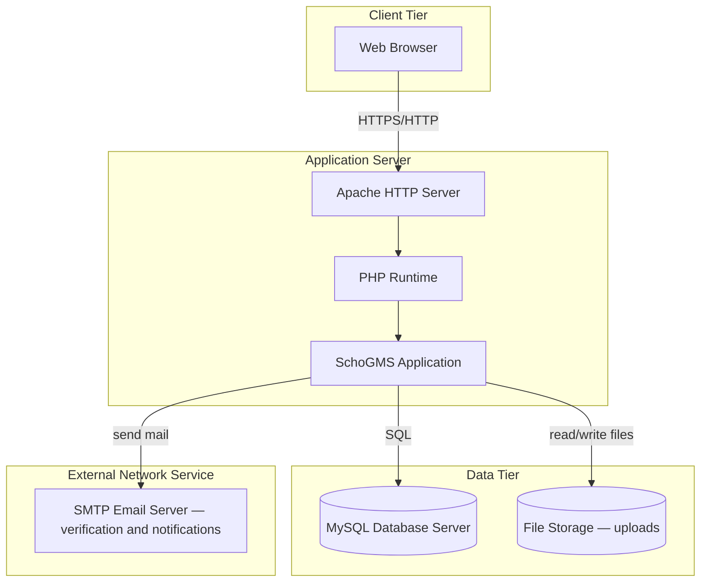

---

## Summary of figures for Chapter 3

| Figure | Section | Title |
|--------|---------|--------|
| 3-1a | 3.3.1 | Layered system architecture |
| 3-1b | 3.3.1 | Functional design (eight modules) |
| 3-2 | 3.3.2 | Use case diagram |
| 3-3 | 3.3.3 | Context diagram |
| 3-4 | 3.3.4 | Level 0 DFD |
| 3-5 | 3.3.4 | Level 1 DFD |
| 3-6 | 3.3.5 | Entity-relationship diagram |
| 3-7 | 3.3.6.1 | Login and 2FA activity |
| 3-8 | 3.3.6.2 | Beneficiary registration activity |
| 3-9 | 3.3.6.3 | Requirements verification activity |
| 3-10 | 3.3.6.4 | Review and approval activity |
| 3-11 | 3.3.7.1 | Login sequence |
| 3-12 | 3.3.7.2 | Masterlist import sequence |
| 3-13 | 3.3.7.3 | Validation sequence |
| 3-14 | 3.3.7.4 | Approval sequence |
| 3-15 | 3.3.8 | Status state diagram |
| 3-16 | 3.3.9 | Deployment diagram |

**Supplementary overview (recommended for oral defense or appendix):** [schogms-activity-diagram.html](./schogms-activity-diagram.html) — four-phase integrated activity view.

---

## References to supporting documentation

- [SchoGMS_System_Documentation.md](./SchoGMS_System_Documentation.md) — pages, roles, and features  
- [SchoGMS_Diagrams_Review_and_Revised.md](./SchoGMS_Diagrams_Review_and_Revised.md) — diagram audit and export notes  
- [tools/README_CAMPUS_ACCESS.md](../tools/README_CAMPUS_ACCESS.md) — campus hierarchy design  

---

*End of Chapter 3 — System Design section.*
