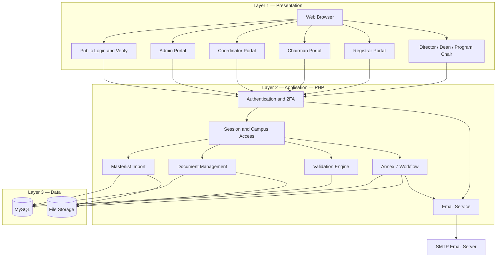
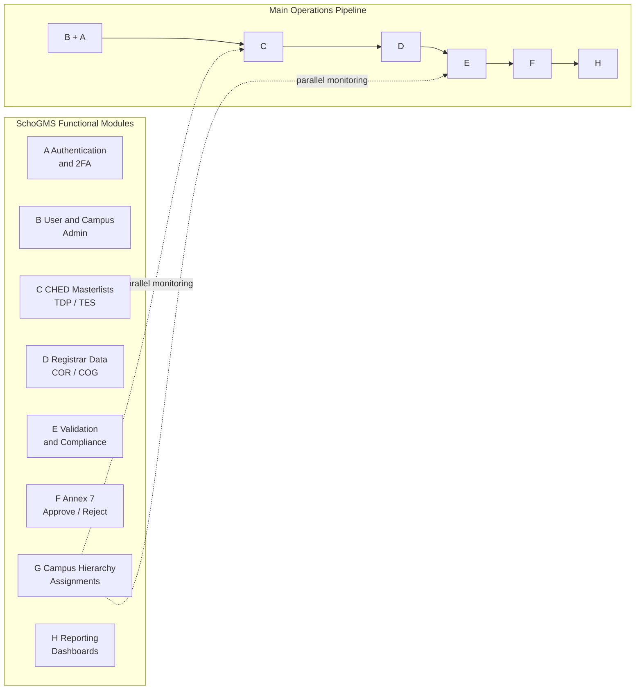
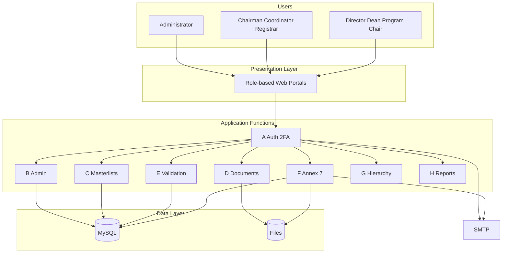

# SchoGMS — System Architecture & Functional Design

**Best visual version:** Open **[schogms-architecture-functional.html](./schogms-architecture-functional.html)** in your browser (print to PDF for your paper).

**Chapter 3 integration:** Paste Section 1–2 below into [Chapter3_System_Design.md](./Chapter3_System_Design.md) §3.3.1 or use as replacement figures.

---

## 1. System Architecture

### Description

The SchoGMS architecture follows a **three-tier, multi-portal web model**. Institutional staff access the system through a web browser. The **presentation tier** includes a public authentication entry (`index.php`, `verify.php`), a separate **administrator portal** (`admin/`), and **seven role-specific modules** under `users/` (coordinator, chairman, registrar, director, dean, program-chair). The **application tier** is implemented in PHP: authentication and two-factor email verification, campus-scoped session control, Excel masterlist import, document upload, TDP/TES validation, Annex 7 approval workflow, and SMTP notifications. The **data tier** consists of a **MySQL** relational database (fourteen core tables) and **filesystem storage** for COR, COG, Annex 7, and import files. **SMTP** is an external service for verification codes and approval emails.

### Meaning of the diagram

Readers can see **where each role lives** in the structure (not one generic dashboard) and **which cross-cutting services** (auth, mail, validation) sit between the UI and the database. This matches the actual XAMPP/LAMP deployment: Apache executes PHP; there is no separate API gateway or microservice layer in the current build.

### Figure caption

*Figure 3-1. Layered system architecture of the SchoGMS showing presentation portals, application modules, data stores, and external email service.*

### Diagram code (paper — layered)



### Diagram code (technical — deployment style)

```mermaid
flowchart TB
  subgraph Client["Client"]
    Browser[Browser]
  end
  subgraph Apache["Apache + PHP"]
    login[login.php / verify_code.php]
    admin[admin/*]
    coord[users/coordinator/*]
    chair[users/chairman/*]
    reg[users/registrar/*]
    hier[users/director | dean | program-chair]
    inc[inc/ + config/]
  end
  subgraph Persist["Persistence"]
    MySQL[(MySQL 14 tables)]
    Disk[uploads/ + annex7]
  end
  Browser --> login & admin & coord & chair & reg & hier
  login & admin & coord & chair & reg & hier --> inc
  inc --> MySQL & Disk
  inc --> SMTP[config/mail.php → SMTP]
```

### Screenshot / export

- **Primary:** PDF from `schogms-architecture-functional.html` Section 1.
- **Alternative:** Mermaid PNG from codes above.

---

## 2. Functional Design

### Description

Functional design decomposes SchoGMS into **eight cohesive functions** (A–H), each mapped to implemented pages and database artifacts. Together they cover the full scholarship lifecycle: provisioning access, loading beneficiaries, attaching compliance documents, validating records, obtaining executive approval on Annex 7, delegating campus leadership, and producing reports.

### Meaning of the diagram

Where the architecture diagram shows **layers and technology**, the functional design shows **what the system does** for users. The pipeline diagram (B → C → D → E → F → H) is the main operational path; function G operates in parallel for organizational structure.

### Figure caption

*Figure 3-2. Functional design of the SchoGMS showing eight modules and the scholarship operations pipeline.*

### Diagram code (functional modules + pipeline)



### Function reference table

| ID | Function | Purpose | Primary roles | Key tables / paths |
|----|----------|---------|---------------|-------------------|
| **A** | Authentication & security | Login, email verification (2FA), session | All staff | `users`, `verification_attempts`, `login.php`, `verify.php` |
| **B** | User & campus administration | Create accounts, campuses, stats | Administrator | `admin/`, `users`, `campuses` |
| **C** | CHED beneficiary masterlists | Import and view TDP/TES rosters | Chairman, coordinator | `ched_masterlist`, `ched_masterlist_tes` |
| **D** | Registrar data & documents | Masterlist, COR/COG upload | Registrar | `registrar_master_list`, `document_uploads` |
| **E** | Validation & compliance | Cross-check lists and documents | Coordinator | `validation_status`, `validate.php` |
| **F** | Annex 7 workflow | Submit, review, approve, reject, notify | Coordinator, chairman | `file_submissions`, `update_status.php` |
| **G** | Campus hierarchy | Directors, deans, program chairs | Coordinator, director, dean | `assigned_dean`, `assigned_program_chairs` |
| **H** | Reporting & dashboards | Charts, tables, exports | All roles (scoped) | Dashboard `index.php`, exports |

### Combined architecture + functional (single figure for thesis)



### Screenshot / export

- **Primary:** PDF from `schogms-architecture-functional.html` Sections 2–3.
- Capture **one sidebar each** for coordinator, chairman, registrar to show functional modules in the UI (optional composite figure).

---

## 3. Recommended paper section

| Content | Section |
|---------|---------|
| System Architecture | Chapter 3 — §3.3.1 System Architecture |
| Functional Design | Chapter 3 — new §3.3.1b Functional Design (or merge with 3.3.1) |
| Combined figure | Figure 3-1a (architecture) and Figure 3-1b (functional) |

---

## 4. One-paragraph summary (copy for thesis)

The SchoGMS is architected as a three-tier web application in which role-specific PHP portals communicate with a shared application core that implements authentication with email-based verification, CHED masterlist management, registrar document handling, record validation, Annex 7 approval, campus hierarchy assignment, and reporting. Persistent data are stored in MySQL and on the server filesystem; notifications are delivered through SMTP. Functionally, the system comprises eight modules that align with institutional roles at Sultan Kudarat State University, supporting campus-scoped scholarship operations from account provisioning through chairman approval of utilization reports.

---

*End of architecture and functional design document.*
