# SchoGMS — Diagram Review, Audit, and Revised Editions

**Document purpose:** Research-paper-ready diagrams verified against the SchoGMS codebase (May 2026).  
**Companion files:** [SchoGMS_System_Diagrams.md](./SchoGMS_System_Diagrams.md) (original set), [schogms-activity-diagram.html](./schogms-activity-diagram.html) (primary activity figure).

---

## Review checklist (audit results)

| Criterion | Result | Notes |
|-----------|--------|-------|
| Matches actual codebase | **Pass** (with scope notes) | PHP/MySQL primary; MongoDB legacy on some paths |
| All user roles represented | **Pass** | Admin, Chairman, Coordinator, Registrar, Director, Dean, Program Chair |
| Student/Guardian | **N/A — not implemented** | Shown only as *Recommended Enhancement* |
| 2FA in authentication diagrams | **Pass** | `verify.php`, `verify_code.php`, `verification_attempts`, `email_verified` |
| Scholarship application workflow | **Pass (mapped)** | Implemented as **CHED masterlist import**, not student portal |
| Requirement upload & verification | **Pass** | `document_uploads`, COR/COG; `validation_status` on `ched_masterlist` |
| Review / approval / rejection | **Pass** | Annex 7: Pending → Approved/Rejected; validation: Validated/Failed |
| Endorsement | **Not in codebase** | No “endorse” feature; use **campus role assignment** (Director→Dean→Chair) |
| Notifications | **Pass** | SMTP: verification, Annex approval, role assignment, some export mails |
| DB tables & relationships | **Pass** | 14 MySQL tables confirmed; `billing_table` **optional** (may not exist locally) |
| Not overcrowded | **Revised** | Paper editions simplified below |
| Formal academic labels | **Revised** | Passive, role-based wording in paper editions |
| Research-paper descriptions | **Revised** | Below per figure |

**Confirmed MySQL tables:** `admin`, `users`, `campuses`, `ched_masterlist`, `ched_masterlist_tes`, `ched_upload_log`, `registrar_master_list`, `document_uploads`, `file_submissions`, `assigned_dean`, `assigned_program_chairs`, `verification_attempts`, `schogms_colleges`, `schogms_courses`.

---

## How to use two editions

| Edition | Audience | Use in thesis |
|---------|----------|----------------|
| **Paper (simplified)** | Panel, Chapter 3–4 | Main body figures; max 8–12 figures total |
| **Technical (detailed)** | Appendix, IT documentation | Full module/table names |

**Recommended paper figures (minimum strong set):** Figure 0 (activity HTML), §2 Use Case (paper), §3 Context, §5 DFD Level 1 (paper), §6 ER (paper), §9 Login/2FA activity, §11 Requirements activity, §12 Review/approval activity, §18 Role access, §20 Deployment.

---

# Figure 0 — Overall Activity Workflow (Primary)

**Recommended paper section:** *Chapter 4 — System Process Model* or *Methodology → Operational Workflow*

### Paper edition
Use **[schogms-activity-diagram.html](./schogms-activity-diagram.html)** or Mermaid in [SchoGMS_Simple_Activity_Diagram.md](./SchoGMS_Simple_Activity_Diagram.md).

### Improved description
The SchoGMS operational model proceeds in four phases: institutional staff account provisioning and email verification; loading of beneficiary rosters and supporting documents; coordinator-led cross-validation against registrar records; and submission and executive approval of the Annex 7 campus report. Beneficiaries do not interact with the system directly.

### Suggested caption
*Figure X. Activity diagram of the SchoGMS scholarship management workflow from account verification through document validation and Annex 7 approval.*

### Screenshot / export
- Open `docs/schogms-activity-diagram.html` in browser → Print to PDF (100% zoom, A4 portrait).
- Or export Mermaid from [mermaid.live](https://mermaid.live).

---

# Diagram 1 — System Architecture

**Recommended paper section:** *Chapter 3 — System Architecture*

### Paper edition (simplified)

**Diagram code:**
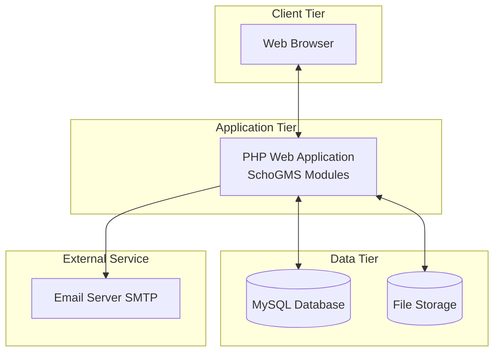

**Improved description:** SchoGMS employs a three-tier architecture. Clients access server-rendered PHP modules through a web browser. The application tier processes authentication, masterlist operations, validation, and file handling. Structured data reside in MySQL; documents reside on the server filesystem. Transactional email supports verification and approval notifications.

**Suggested caption:** *Figure 1. Three-tier architecture of the SchoGMS.*

**Screenshot / export:** Recreate in draw.io or export Mermaid PNG; no live UI screenshot required.

### Technical edition (detailed)

**Diagram code:**
```mermaid
flowchart TB
  subgraph Presentation["Presentation Layer"]
    PUB[index.php / verify.php]
    ADM[admin/ portal]
    ROLE[users/coordinator | chairman | registrar | director | dean | program-chair]
  end
  subgraph Application["Application Layer"]
    AUTH[login.php + config/mysql_auth.php]
    VFY[inc/verify_account.php + verify_code.php]
    SESS[per-role config/session.php]
    BIZ[process_excel.php validate APIs submit_* upload_*]
    SMTP[config/mail.php]
  end
  subgraph Data["Data Layer"]
    MY[(MySQL)]
    MG[(MongoDB legacy file-store)]
    FS[uploads/ annex7 COR COG]
  end
  PUB --> AUTH
  ADM --> MY
  ROLE --> SESS --> BIZ
  AUTH --> MY
  AUTH --> MG
  VFY --> MY
  BIZ --> MY
  BIZ --> FS
  BIZ --> MG
  SMTP --> External[SMTP]
```

**Suggested caption:** *Figure A.1. Detailed logical architecture of the SchoGMS (technical documentation).*

---

# Diagram 2 — Use Case

**Recommended paper section:** *Chapter 3 — Functional Requirements / Use Case Model*

### Paper edition (simplified)

**Diagram code (PlantUML):**
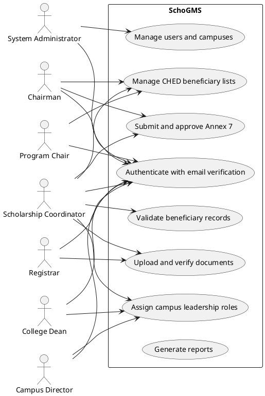

**Improved description:** The use case model defines eight functional areas accessed by seven operational roles. The administrator provisions accounts. The chairman provides system-wide oversight and Annex 7 approval. The coordinator performs campus-level validation and reporting. The registrar maintains academic documents. The director, dean, and program chair support hierarchical campus governance and monitoring. Scholar self-service is outside the current system scope.

**Suggested caption:** *Figure 2. Use case diagram of the SchoGMS showing role-based functional access.*

**Screenshot / export:** PlantUML PNG; optional: composite with role list table from system documentation.

### Technical edition
Retain full use cases in [SchoGMS_System_Diagrams.md](./SchoGMS_System_Diagrams.md) §2 (includes TDP/TES split, billing import, legacy enhancement actors).

---

# Diagram 3 — Context Diagram

**Recommended paper section:** *Chapter 3 — System Context*

### Paper edition

**Diagram code:**
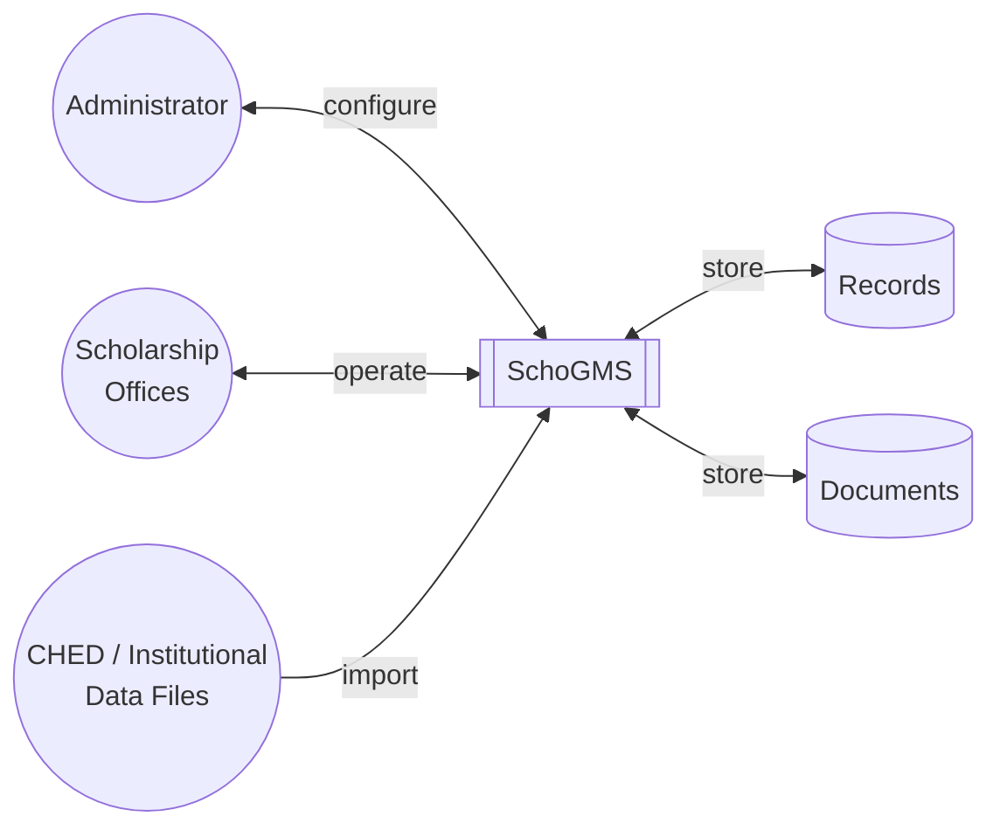

**Improved description:** SchoGMS acts as the central information system between institutional users and stored scholarship records. External Excel files supply beneficiary data. The administrator configures users and campuses. Scholarship and registrar offices execute validation and reporting within the system boundary.

**Suggested caption:** *Figure 3. Context diagram of the SchoGMS and its external entities.*

**Screenshot / export:** Mermaid/draw.io only.

### Technical edition
Add SMTP, Registrar Office, Campus Leadership splits — see original §3 in System_Diagrams.md.

---

# Diagram 4 — DFD Level 0

**Recommended paper section:** *Chapter 3 — Data Flow Overview*

### Paper edition

**Diagram code:**
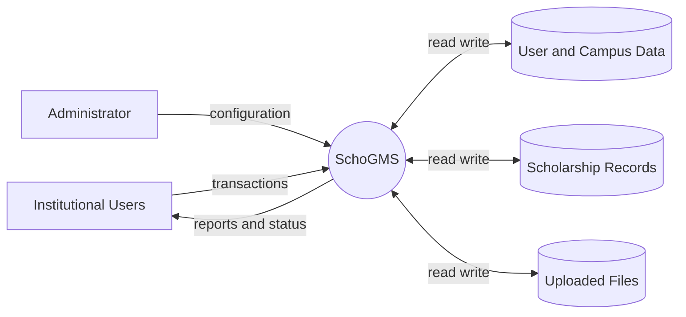

**Improved description:** At context level, the system exchanges configuration data with the administrator and operational data with institutional users. Internal data stores maintain user accounts, scholarship masterlists, and uploaded documents.

**Suggested caption:** *Figure 4. Level 0 data flow diagram of the SchoGMS.*

### Technical edition
Original §4 with CHED Excel entity — unchanged structurally.

---

# Diagram 5 — DFD Level 1

**Recommended paper section:** *Chapter 3 — Process Decomposition*

### Paper edition (5 processes)

**Diagram code:**
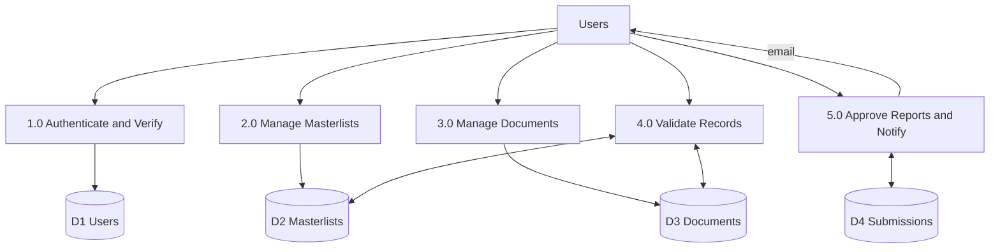

**Improved description:** Level 1 decomposition identifies five processes: authentication with email verification, masterlist management, document management, record validation, and report approval with notification. Validation consumes both masterlist and document stores.

**Suggested caption:** *Figure 5. Level 1 data flow diagram of the SchoGMS.*

### Technical edition
Seven processes (add Admin User Mgmt, separate Annex 7) — original §5.

---

# Diagram 6 — Entity-Relationship Diagram

**Recommended paper section:** *Chapter 3 — Data Model* or *Appendix*

### Paper edition (core entities only)

**Diagram code:**
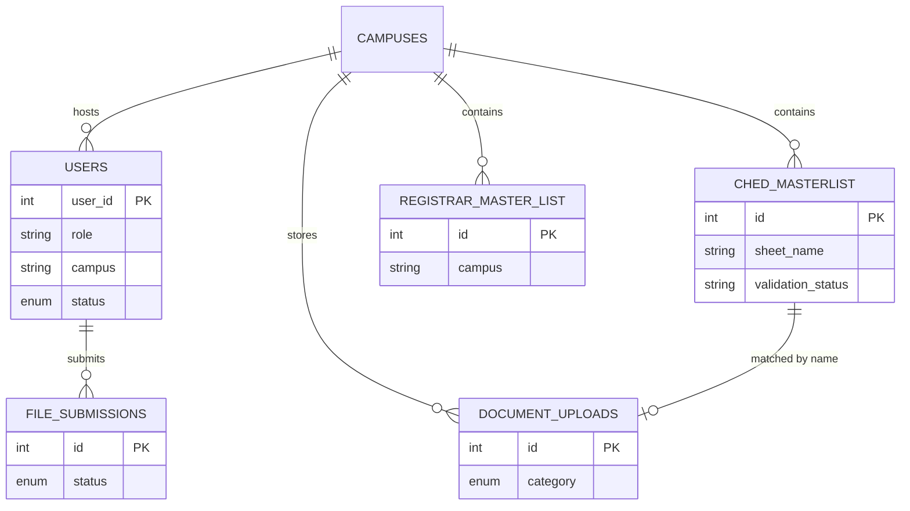

**Improved description:** The conceptual data model links operational users to campus-scoped scholarship records, registrar reference data, uploaded documents, and formal submissions. Logical matching between beneficiary names and document filenames supports validation; formal foreign keys are not enforced on all relationships.

**Suggested caption:** *Figure 6. Conceptual entity-relationship diagram of core SchoGMS entities.*

### Technical edition
Add `assigned_dean`, `assigned_program_chairs`, `ched_masterlist_tes`, `verification_attempts`, `schogms_colleges/courses` — original §6.

---

# Diagram 7 — Database Schema

**Recommended paper section:** *Appendix — Database Design*

### Paper edition
Use a **table list figure** in Word instead of full schema diagram:

| Table | Purpose |
|-------|---------|
| `users` | Staff accounts, roles, verification |
| `ched_masterlist` / `ched_masterlist_tes` | TDP/TES beneficiaries |
| `registrar_master_list` | Registrar enrollment data |
| `document_uploads` | COR/COG index |
| `file_submissions` | Annex 7 tracking |
| `assigned_dean` / `assigned_program_chairs` | College/program leadership logins |

**Suggested caption:** *Table X. Primary database tables of the SchoGMS.*

### Technical edition
Class diagram of all 14 tables — original §7; note `billing_table` only if `SHOW TABLES` confirms it on deployment DB.

---

# Diagram 8 — Class Diagram

**Recommended paper section:** *Appendix only* (optional)

**Note:** SchoGMS uses procedural PHP; class diagram is **logical modules only**.

**Paper edition:** Omit from main chapter to avoid overcrowding.

**Technical edition:** Retain original §8.

**Suggested caption:** *Figure A.2. Logical module diagram of SchoGMS PHP components.*

---

# Diagram 9 — Activity: Login and 2FA

**Recommended paper section:** *Chapter 4 — Security / Authentication*

### Paper edition

**Diagram code:**
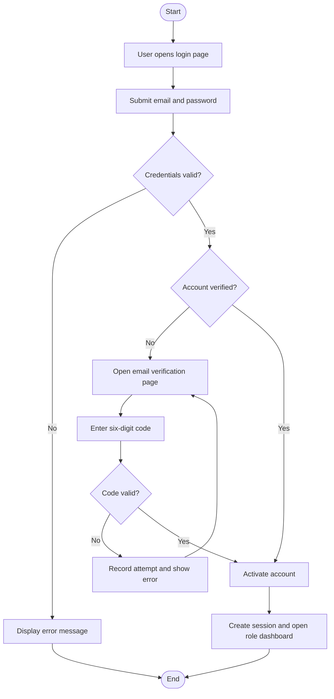

**Improved description:** Authentication requires valid credentials and, for newly provisioned accounts, successful email verification using a time-limited numeric code. Failed verification attempts are logged. Upon success, the system establishes a session and routes the user to a role-specific dashboard.

**Suggested caption:** *Figure 7. Activity diagram of user login and email-based two-factor verification in the SchoGMS.*

**Screenshot / export:** `index.php`, `verify.php` (pending + success states), `users/coordinator/index.php` after login.

### Technical edition
Include `login.php`, `verify_code.php`, `verification_attempts`, chairman pre-activated exception — original §9.

---

# Diagram 10 — Activity: Beneficiary Registration (Scholarship Intake)

**Recommended paper section:** *Chapter 4 — Beneficiary Management*

**Terminology:** Not a student application portal; **institutional masterlist import**.

### Paper edition

**Diagram code:**
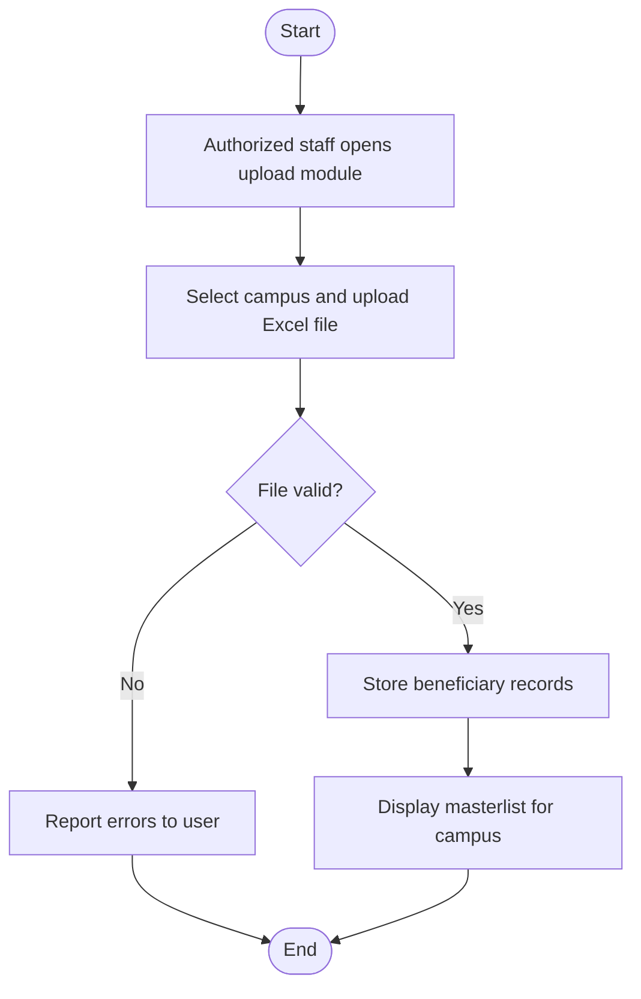

**Improved description:** Beneficiary registration is performed by authorized staff through bulk import of CHED-formatted masterlists. The system validates file structure, persists records to the campus masterlist, and presents the data for subsequent validation. A scholar-facing application module is not part of the current implementation.

**Suggested caption:** *Figure 8. Activity diagram of beneficiary registration through CHED masterlist import in the SchoGMS.*

**Screenshot / export:** `users/coordinator/ched_masterlist.php` upload form; table with data after seed.

### Technical edition
`process_excel.php`, `ched_upload_log`, TDP vs TES tables — original §10.

---

# Diagram 11 — Activity: Requirements Upload and Verification

**Recommended paper section:** *Chapter 4 — Document Compliance*

### Paper edition

**Diagram code:**
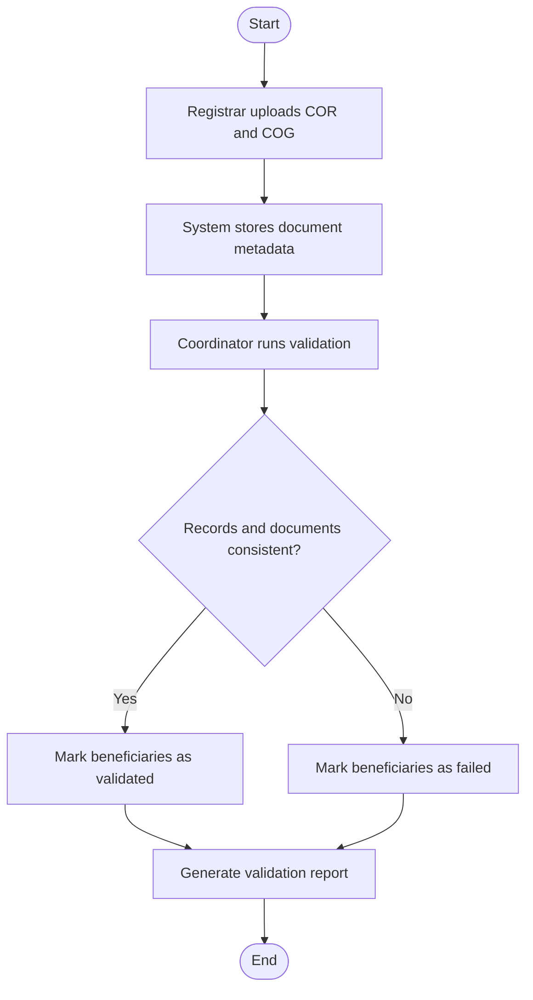

**Improved description:** Documentary requirements are fulfilled when the registrar uploads Certificates of Registration and Grades. The coordinator compares beneficiary masterlist entries, registrar records, and uploaded documents. Each record receives a validation outcome used in compliance reporting.

**Suggested caption:** *Figure 9. Activity diagram of document upload and beneficiary validation in the SchoGMS.*

**Screenshot / export:** `users/registrar/cor-cog.php`, `users/coordinator/validate.php` with filters and results.

### Technical edition
`document_uploads`, `auto_validate_tdp.php`, `validation_status` — original §11.

---

# Diagram 12 — Activity: Review, Approval, Rejection, and Notification

**Recommended paper section:** *Chapter 4 — Approval Workflow*

**Note:** The term **endorsement** does not appear in the codebase. Campus **role assignment** (Director assigns Dean, Dean assigns Program Chair) is a separate administrative flow with email notification. **Annex 7** is the primary approval/rejection workflow for the paper.

### Paper edition

**Diagram code:**
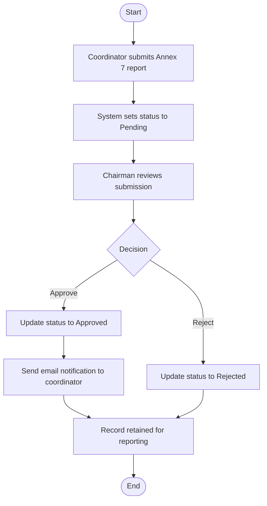

**Improved description:** Campus reporting concludes with Annex 7 submission by the coordinator. The chairman examines the submission and records an approval or rejection decision. Approved submissions trigger email notification to the submitting coordinator. All outcomes are retained for audit and reporting.

**Suggested caption:** *Figure 10. Activity diagram of Annex 7 review, approval, rejection, and notification in the SchoGMS.*

**Screenshot / export:** `users/coordinator/submit_form.php`, `users/chairman/anex-form2.php` with Approve/Reject and preview modal.

### Technical edition
Add optional billing import, Pending hold state — original §12.

---

# Diagram 13 — Sequence: Login and 2FA

**Recommended paper section:** *Appendix — Interaction Model*

### Paper edition (fewer participants)

**Diagram code:**
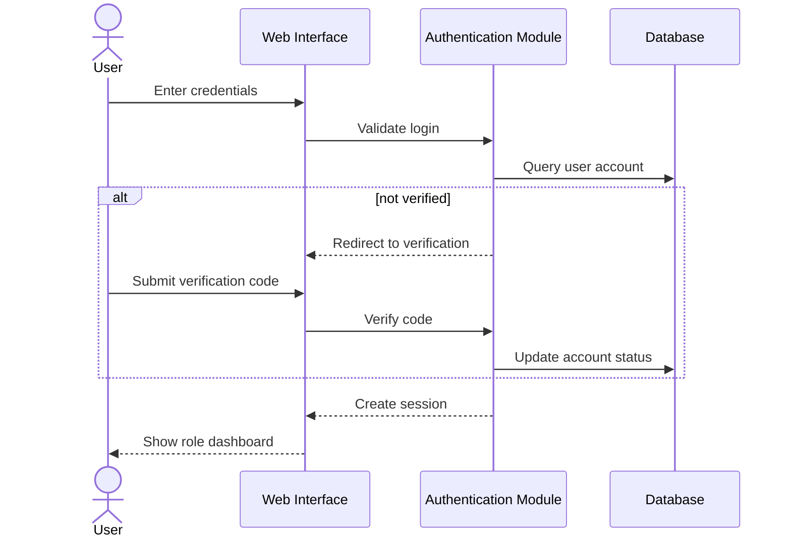

**Suggested caption:** *Figure A.3. Sequence diagram of authentication and email verification.*

**Screenshot / export:** Optional sequence overlay; login/verify screenshots sufficient for paper.

### Technical edition
Full participant list — original §13.

---

# Diagram 14 — Sequence: Masterlist Import

**Recommended paper section:** *Appendix*

### Paper edition
Same as Diagram 10 sequence — Chairman/Coordinator → Upload → Database.

**Suggested caption:** *Figure A.4. Sequence diagram of CHED masterlist import.*

**Screenshot / export:** Network tab optional; upload UI screenshot preferred.

---

# Diagram 15 — Sequence: Requirements Review

**Recommended paper section:** *Appendix*

### Paper edition

**Diagram code:**
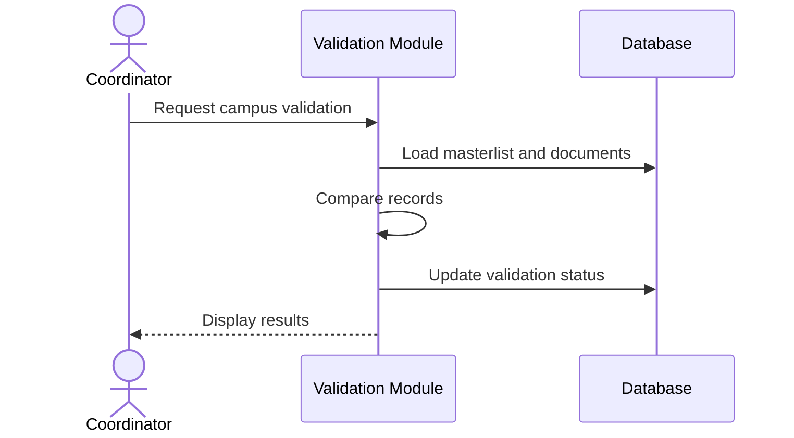

**Suggested caption:** *Figure A.5. Sequence diagram of coordinator-led record validation.*

---

# Diagram 16 — Sequence: Annex Approval

**Recommended paper section:** *Appendix*

### Paper edition

**Diagram code:**
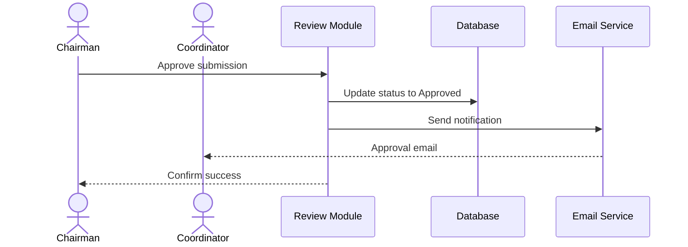

**Suggested caption:** *Figure A.6. Sequence diagram of Annex 7 approval and notification.*

---

# Diagram 17 — State Diagram

**Recommended paper section:** *Chapter 4 — Status Model*

### Paper edition (two parallel state machines)

**Diagram code:**
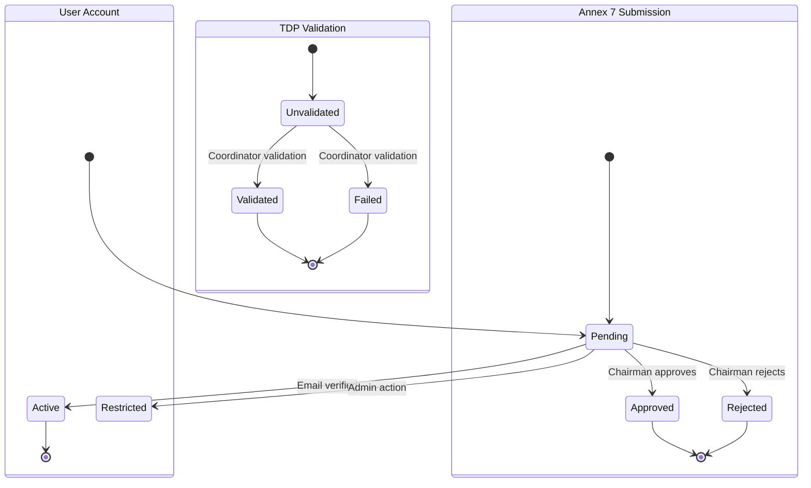

**Improved description:** SchoGMS maintains distinct status models for user accounts, formal campus submissions, and beneficiary validation outcomes. These states are independent but collectively describe scholarship processing progress.

**Suggested caption:** *Figure 11. State diagram of user account, Annex 7 submission, and beneficiary validation statuses.*

### Technical edition
Original §17 composite diagram.

---

# Diagram 18 — User Role Access

**Recommended paper section:** *Chapter 3 — Access Control*

### Paper edition

**Diagram code:**
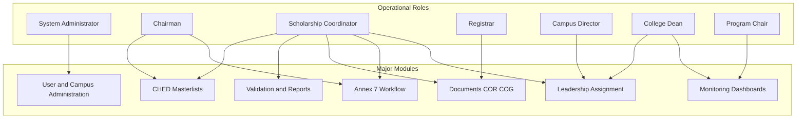

**Improved description:** Access is organized by institutional role. The administrator manages configuration. The chairman and coordinator perform scholarship operations. The registrar supplies documents. The director, dean, and program chair support hierarchical governance and monitoring within assigned scope.

**Suggested caption:** *Figure 12. Role-based access map of SchoGMS functional modules.*

**Screenshot / export:** One sidebar per role (coordinator, chairman, registrar) showing menu differences.

---

# Diagram 19 — Sitemap

**Recommended paper section:** *Appendix — User Interface Structure*

### Paper edition
Limit to **three role trees** (Coordinator, Chairman, Registrar) — original §19 trimmed to 15 nodes max.

**Suggested caption:** *Figure A.7. Navigation structure for primary SchoGMS roles.*

**Screenshot / export:** Full-window captures per role dashboard with sidebar visible.

---

# Diagram 20 — Deployment

**Recommended paper section:** *Chapter 3 — Deployment Environment*

### Paper edition
Retain simplified §20 from original (Browser → Apache/PHP → MySQL + Files + SMTP).

**Suggested caption:** *Figure 13. Deployment diagram of the SchoGMS on Apache, PHP, and MySQL.*

**Screenshot / export:** XAMPP control panel optional; architecture diagram sufficient.

---

# Diagram 21 — Component

**Recommended paper section:** *Appendix only*

**Paper edition:** Omit or use simplified 4-component version (UI, Auth, Business Logic, Data Access).

**Technical edition:** Original §21.

---

# Diagram 22 — Report Generation

**Recommended paper section:** *Chapter 4 — Reporting*

### Paper edition

**Diagram code:**
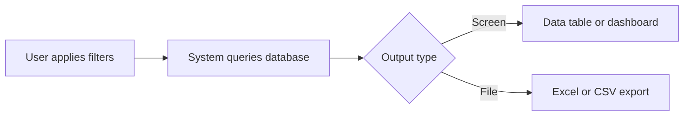

**Improved description:** Reporting is generated on demand from filtered database queries. Results are viewed in the application or exported to spreadsheet formats for institutional use.

**Suggested caption:** *Figure 14. Report generation flow in the SchoGMS.*

**Screenshot / export:** Validation export download; chairman dashboard charts.

---

# Diagram 23 — Notification Flow

**Recommended paper section:** *Chapter 4 — Communication*

### Paper edition

**Diagram code:**
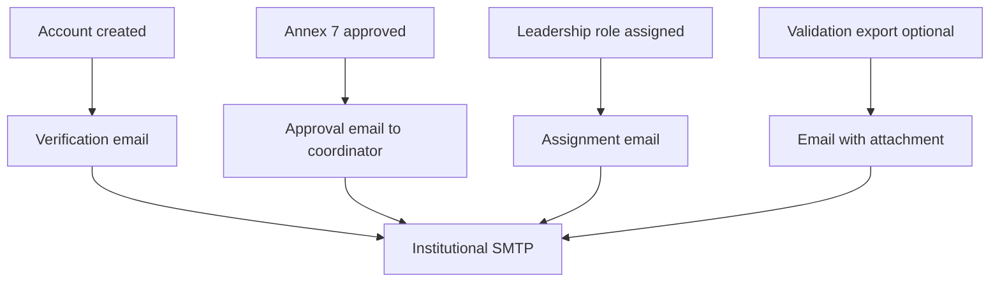

**Improved description:** System notifications are delivered primarily through email using institutional SMTP settings. Triggers include account verification, Annex 7 approval, leadership role assignment, and selected validation exports.

**Suggested caption:** *Figure 15. Notification flow for email-based alerts in the SchoGMS.*

**Note:** There is no in-application notification inbox (**Recommended Enhancement**).

---

# Diagram 24 — Audit Trail / Logging

**Recommended paper section:** *Chapter 4 — Accountability* (with limitation statement)

### Paper edition

**Diagram code:**
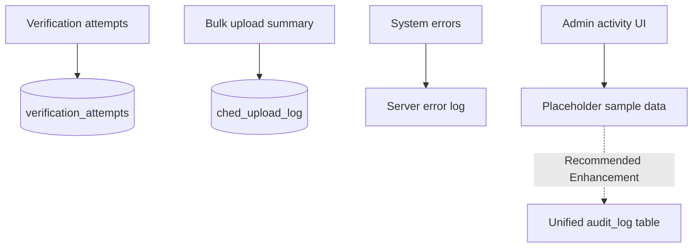

**Improved description:** Accountability is supported through verification attempt logging, upload transaction logs, and server-side error logging. A consolidated administrative audit viewer is not fully implemented; the admin logs interface currently displays illustrative sample entries and should not be cited as live audit data without further development.

**Suggested caption:** *Figure 16. Audit and logging mechanisms in the SchoGMS (with noted limitations).*

**Screenshot / export:** Do **not** use `admin/logs.php` as evidence unless replaced with real logging; cite `verification_attempts` table structure instead.

---

## Summary: What changed in this revision

1. **Formal academic labels** on all paper editions (role titles, process names).  
2. **Simplified paper editions** for overcrowded diagrams (1, 2, 5, 6, 18, 22–24).  
3. **2FA explicitly** in diagrams 9 and 13.  
4. **Application workflow** renamed to beneficiary registration (import).  
5. **Endorsement** replaced with accurate **approval/rejection** and **role assignment** notes.  
6. **Schema** aligned to 14 confirmed tables; billing marked optional.  
7. **Figure 0 / HTML activity** designated as the primary process figure.  
8. **Screenshot guide** per critical figure for thesis evidence.

---

## Rendering checklist for thesis submission

| Priority | Figure | Export method |
|:--------:|--------|---------------|
| 1 | Overall activity | PDF from `schogms-activity-diagram.html` |
| 2 | Use case (paper) | PlantUML PNG |
| 3 | Architecture (paper) | Mermaid PNG |
| 4 | DFD Level 1 (paper) | Mermaid PNG |
| 5 | ER (paper) | Mermaid PNG |
| 6 | Login/2FA activity | Mermaid PNG + UI screenshots |
| 7 | Validation activity | Mermaid PNG + `validate.php` screenshot |
| 8 | Annex approval activity | Mermaid PNG + `anex-form2.php` screenshot |
| 9 | Role access | Mermaid PNG |
| 10 | Deployment | Mermaid PNG |

*End of review and revised editions.*
