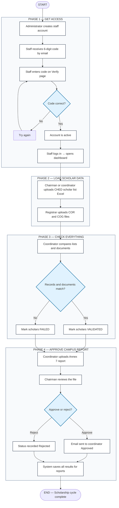

# SchoGMS — Activity Diagram (Best Overview)

**The easiest way to understand SchoGMS:** open the visual page in your browser, or use the diagram below.

| Format | File | Best for |
|--------|------|----------|
| **Visual (recommended)** | [schogms-activity-diagram.html](./schogms-activity-diagram.html) | Paper screenshots, panel presentation, printing |
| **Interactive** | `canvases/schogms-activity-workflow.canvas.tsx` | Explore phases in Cursor (open beside chat) |
| **Mermaid** | Code below | GitHub, Word via mermaid.live export |

---

## The whole story in one sentence

**Staff get accounts → verify email → upload scholar lists and COR/COG → coordinator checks matches → coordinator sends Annex 7 → chairman approves → done.**

Scholars **do not log in** — their names come from uploaded Excel lists.

---

## Diagram (4 phases — top to bottom)

---

## Who does what (quick reference)

| Phase | Who | What |
|:-----:|-----|------|
| 1 | **Administrator** | Creates user accounts |
| 1 | **Staff** | Verifies email, logs in |
| 2 | **Chairman / Coordinator** | Uploads official scholar list |
| 2 | **Registrar** | Uploads COR & COG |
| 3 | **Coordinator** | Validates data, marks pass/fail |
| 4 | **Coordinator** | Submits Annex 7 |
| 4 | **Chairman** | Approves or rejects |
| 4 | **System** | Stores data for dashboards and exports |

---

## Figure caption (copy for your paper)

*Figure X. Activity diagram of the SchoGMS organized in four phases: staff access and verification, loading of scholar data and documents, coordinator validation, and chairman approval of the Annex 7 campus report.*

---

## Export as PNG for Word / PDF

1. Open [schogms-activity-diagram.html](./schogms-activity-diagram.html) in Chrome → **Print → Save as PDF** (best layout), or screenshot.  
2. Or paste the Mermaid block into [mermaid.live](https://mermaid.live) → **Export PNG/SVG**.
