# SchoGMS — System Diagrams for Research Documentation

> **Revised editions (paper + technical, audit checklist, captions, screenshot guide):**  
> See **[SchoGMS_Diagrams_Review_and_Revised.md](./SchoGMS_Diagrams_Review_and_Revised.md)** — use that file for your thesis figures.  
> This file retains the original detailed diagram set for reference.

**System:** Scholarship and Grants Management System (SchoGMS)  
**Basis:** Codebase review (`users/`, `admin/`, `config/`, `inc/`, MySQL schema, `docs/SchoGMS_System_Documentation.md`)  
**Stack:** PHP (server-rendered pages), MySQL (primary), MongoDB file-store (legacy path), SMTP email, local/XAMPP deployment  

**Scope notes (read before using figures):**
- **Student/Scholar** and **Guardian** login portals are **not implemented**; scholars exist as rows in `ched_masterlist`, `ched_masterlist_tes`, and `registrar_master_list`.
- **Self-service scholarship application** (student fills a web form) is **not implemented**; workflows use **Excel/masterlist import**, **registrar uploads**, and **staff validation**.
- Diagrams 10, 14, and 17 that refer to “student application” are **mapped to the implemented CHED masterlist + validation workflow** and labeled accordingly.
- `admin/logs.php` shows **sample/placeholder rows** — not a live audit table (**Needs Verification**).
- `billing_table` is **optional** (used when present on chairman/coordinator verified-scholars pages).

---

## Simple Activity Diagram — How SchoGMS Works (Easy to Read)

**Diagram Type:** Activity Diagram (premium / reader-friendly)  

**Purpose:** The clearest single figure for your paper: four colored phases, plain language, role legend, no technical jargon.

**Best formats (pick one):**
- **HTML (recommended for screenshots):** [schogms-activity-diagram.html](./schogms-activity-diagram.html) — open in browser, print to PDF.
- **Interactive:** `canvases/schogms-activity-workflow.canvas.tsx` in Cursor.
- **Full write-up:** [SchoGMS_Simple_Activity_Diagram.md](./SchoGMS_Simple_Activity_Diagram.md)

**Description / Meaning:** SchoGMS runs in four phases: (1) staff get access through admin-created accounts and email verification; (2) scholar names and COR/COG documents are uploaded; (3) the coordinator checks whether records match; (4) Annex 7 is submitted and the chairman approves or rejects. Scholars never log in—their names exist only on uploaded lists.

**Diagram Code:**
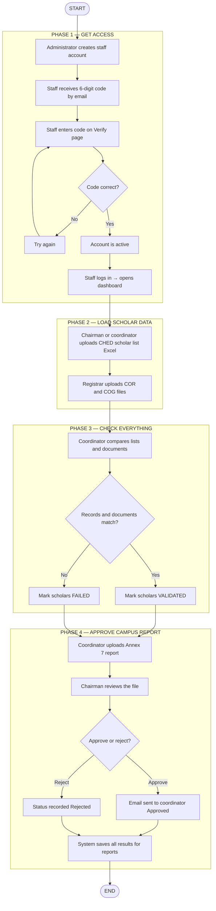

**One-line summary:** Admin → verify → login → upload lists & documents → validate → Annex 7 → chairman approves → saved for reports.

**Note:** No student or guardian login in the current system.

**Suggested Figure Caption:** *Figure 0. Activity diagram of the SchoGMS in four phases: access, data loading, validation, and Annex 7 approval.*

---

## 1. System Architecture Diagram

**Diagram Type:** System Architecture Diagram  

**Purpose:** Shows major layers, modules, and data stores of SchoGMS as implemented.

**Description / Meaning:** SchoGMS follows a classic three-tier web architecture. The presentation layer consists of role-specific PHP pages under `users/{role}/` and a separate `admin/` portal. The application layer handles authentication (`login.php`, `config/mysql_auth.php`), email verification (`inc/verify_account.php`), masterlist processing, validation, and file uploads. Persistent data is stored primarily in **MySQL**. A **legacy MongoDB** file-based store (`conn_mongodb.php`) remains for some historical paths. Uploaded documents (COR, COG, Annex 7, Excel) are stored on the **filesystem** under `uploads/` and role-specific folders. Outbound **SMTP** supports verification and approval notifications.

**Diagram Code:**
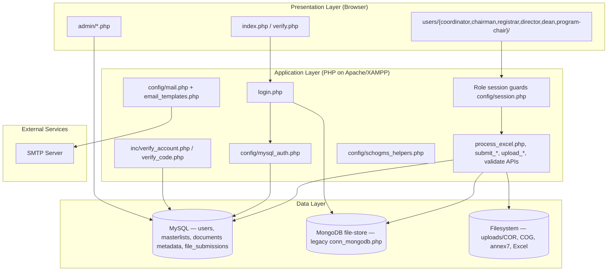

**Suggested Figure Caption:** *Figure 1. Layered system architecture of the SchoGMS showing PHP application modules, MySQL persistence, filesystem storage, and SMTP integration.*

---

## 2. Use Case Diagram

**Diagram Type:** Use Case Diagram  

**Purpose:** Summarizes actors and major use cases grounded in implemented modules.

**Description / Meaning:** Actors include **System Administrator**, **Chairman**, **Coordinator** (scholarship staff), **Registrar**, **Director**, **Dean**, and **Program Chair**. Use cases reflect actual pages: user provisioning, CHED TDP/TES masterlist management, registrar masterlist and COR/COG uploads, cross-validation, Annex 7 submission and approval, campus hierarchy assignment, and reporting/exports. **Student** and **Guardian** actors are shown dashed as **Recommended Enhancement** because no login module exists.

**Diagram Code (PlantUML):**
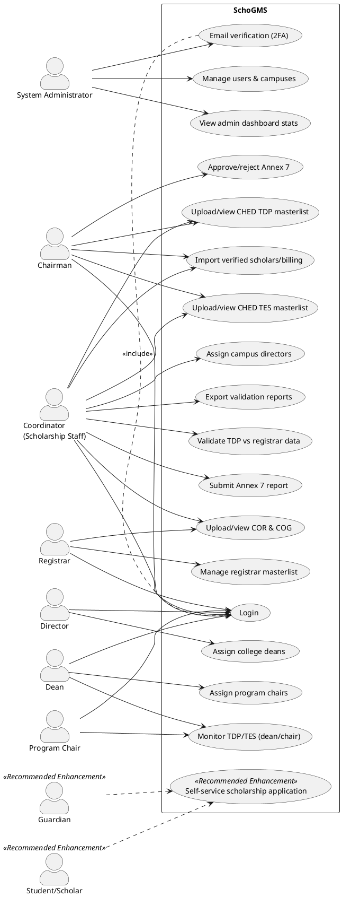

**Suggested Figure Caption:** *Figure 2. Use case diagram of the SchoGMS illustrating role-based functions; student self-service application is marked as a recommended enhancement.*

---

## 3. Context Diagram

**Diagram Type:** Context Diagram (Level 0 external view)  

**Purpose:** Defines SchoGMS boundary and external entities.

**Description / Meaning:** SchoGMS operates as a central system interacting with institutional staff through web browsers, the **MySQL** database for structured records, the **file system** for documents, and **email** for verification and notifications. External entities include CHED-related data sources (imported via Excel), campus offices (coordinator, registrar, leadership roles), and the system administrator.

**Diagram Code:**
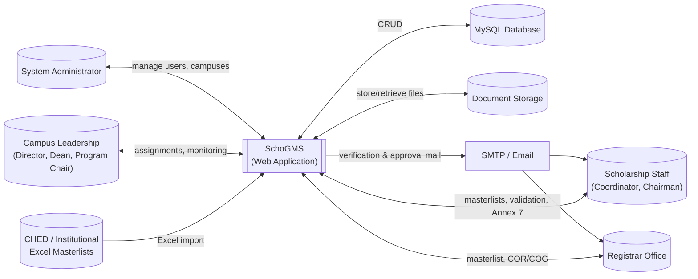

**Suggested Figure Caption:** *Figure 3. Context diagram of the SchoGMS and its interaction with institutional actors and external data sources.*

---

## 4. Level 0 Data Flow Diagram

**Diagram Type:** DFD Level 0  

**Purpose:** High-level data flows between external entities and the system.

**Description / Meaning:** At Level 0, data enters SchoGMS as **login credentials**, **verification codes**, **Excel masterlists**, **registrar lists**, **COR/COG files**, and **Annex 7 submissions**. The system outputs **dashboards**, **validation results**, **approval status**, **reports/exports**, and **email notifications**.

**Diagram Code:**
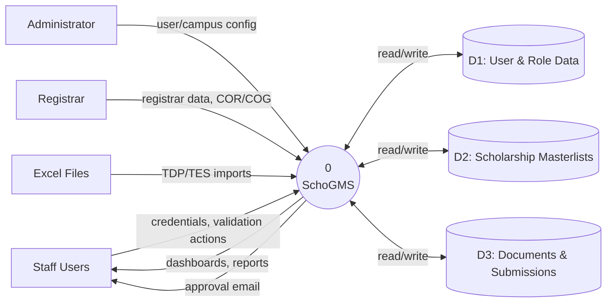

**Suggested Figure Caption:** *Figure 4. Level 0 data flow diagram of the SchoGMS.*

---

## 5. Level 1 Data Flow Diagram

**Diagram Type:** DFD Level 1  

**Purpose:** Decomposes SchoGMS into major processes aligned with code modules.

**Description / Meaning:** Level 1 expands the system into **P1 Authentication & Verification**, **P2 User & Campus Administration**, **P3 Masterlist Management**, **P4 Document Management**, **P5 Validation & Cross-Matching**, **P6 Annex 7 Workflow**, and **P7 Reporting & Export**. Data stores match MySQL tables and upload directories.

**Diagram Code:**
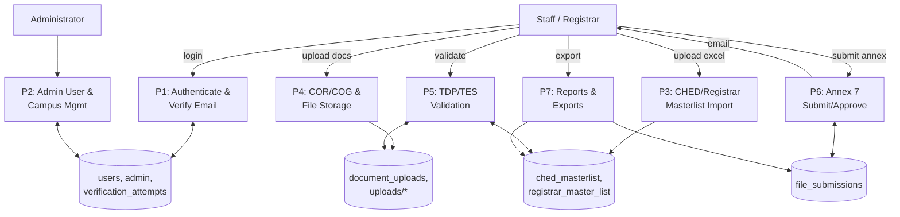

**Suggested Figure Caption:** *Figure 5. Level 1 data flow diagram decomposing SchoGMS into authentication, administration, masterlist, document, validation, Annex 7, and reporting processes.*

---

## 6. Entity-Relationship Diagram

**Diagram Type:** ER Diagram (conceptual)  

**Purpose:** Shows principal entities and relationships in the MySQL schema.

**Description / Meaning:** The ER model centers on **users** (operational accounts), **campuses**, role-assignment tables (**assigned_dean**, **assigned_program_chairs**), scholarship rosters (**ched_masterlist**, **ched_masterlist_tes**), registrar records (**registrar_master_list**), uploaded documents (**document_uploads**), and compliance submissions (**file_submissions**). Relationships are predominantly logical (campus name matching) rather than strict foreign keys in all cases.

**Diagram Code:**
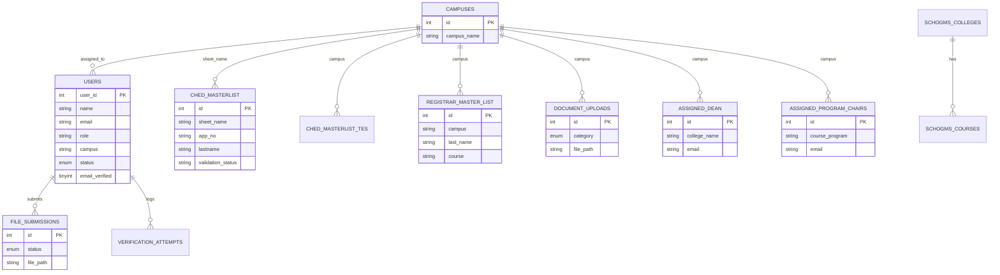

**Suggested Figure Caption:** *Figure 6. Entity-relationship diagram of core SchoGMS database entities.*

---

## 7. Database Schema Diagram

**Diagram Type:** Database Schema Diagram  

**Purpose:** Lists implemented MySQL tables and key columns for documentation.

**Description / Meaning:** The physical schema supports multi-campus scholarship operations. The `users` table stores coordinator, chairman, registrar, and director accounts with verification fields. `assigned_dean` and `assigned_program_chairs` store college/program leadership credentials. Masterlist tables hold beneficiary records. `document_uploads` indexes COR/COG files. `file_submissions` tracks Annex 7. Optional `billing_table` (**Needs Verification** on deployment) supports verified-scholar payment imports.

**Diagram Code:**
```mermaid
classDiagram
  class admin {
    admin_id PK
    username
    password
  }
  class users {
    user_id PK
    email
    role
    campus
    status
    verification_code
    email_verified
  }
  class campuses {
    id PK
    campus_name
  }
  class ched_masterlist {
    id PK
    sheet_name
    app_no
    lastname
    validation_status
  }
  class ched_masterlist_tes {
    id PK
    campus
    app_no
  }
  class registrar_master_list {
    id PK
    campus
    last_name
    course
  }
  class document_uploads {
    id PK
    category COR/COG
    file_path
  }
  class file_submissions {
    id PK
    status Pending/Approved/Rejected
  }
  class assigned_dean {
    id PK
    college_name
    email
  }
  class assigned_program_chairs {
    id PK
    course_program
    email
  }
  class verification_attempts {
    id PK
    email
    attempt_time
  }
  class schogms_colleges {
    id PK
    campus
  }
  class schogms_courses {
    id PK
    college_id FK
  }
  class billing_table {
    <<optional>>
    Needs Verification
  }
```

**Suggested Figure Caption:** *Figure 7. Database schema overview of the SchoGMS MySQL tables.*

---

## 8. Class Diagram

**Diagram Type:** Class Diagram (logical / module-level)  

**Purpose:** Describes major PHP modules as logical classes (SchoGMS is procedural PHP, not OOP MVC).

**Description / Meaning:** SchoGMS does not use a framework-style class model for controllers; instead, **include files** and **namespaced functions** encapsulate behavior. The diagram documents this **logical structure** for academic completeness. **Needs Verification:** some legacy pages call MongoDB wrappers directly.

**Diagram Code:**
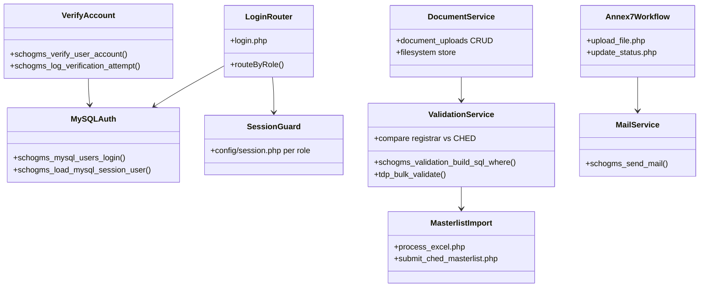

**Suggested Figure Caption:** *Figure 8. Logical class diagram of major SchoGMS PHP modules and their dependencies.*

---

## 9. Activity Diagram — Login and 2FA Verification

**Diagram Type:** Activity Diagram  

**Purpose:** Documents authentication and email verification as implemented.

**Description / Meaning:** Users authenticate at `index.php` → `login.php`. MySQL users with `email_verified = 0` are redirected to `verify.php`. Successful verification via `verify_code.php` activates the account and starts a session. Failed attempts may be recorded in `verification_attempts`. Chairman accounts may be created pre-verified by the administrator.

**Diagram Code:**
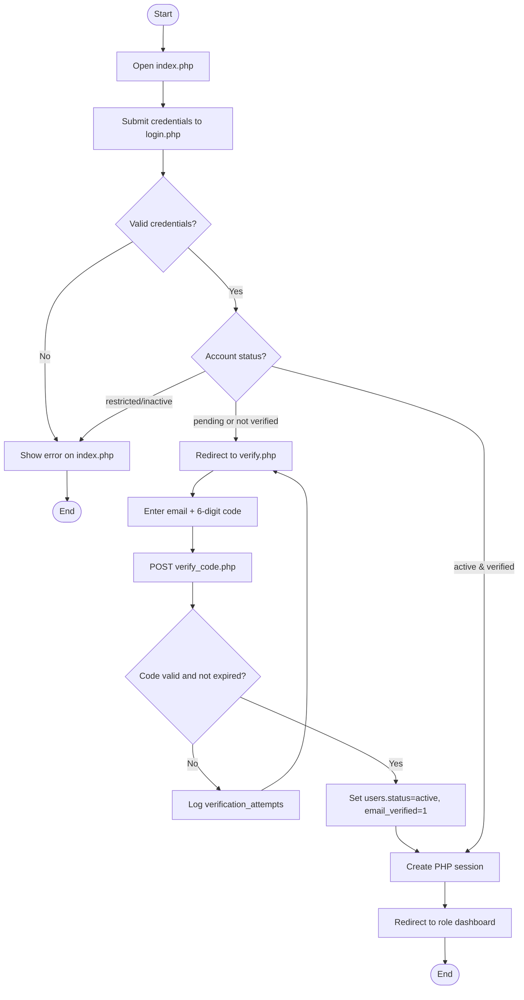

**Suggested Figure Caption:** *Figure 9. Activity diagram of login and email-based two-factor verification in the SchoGMS.*

---

## 10. Activity Diagram — Student Scholarship Application

**Diagram Type:** Activity Diagram  

**Purpose:** Documents scholarship beneficiary intake as actually implemented.

**Description / Meaning:** **Recommended Enhancement:** a student self-service application portal. **Implemented equivalent:** CHED TDP/TES beneficiaries are onboarded through **Excel upload** by Chairman or Coordinator (`submit_ched_masterlist.php`, `process_excel.php`), creating rows in `ched_masterlist` / `ched_masterlist_tes`. Coordinators may also work with registrar-sourced lists. This activity diagram therefore reflects **institutional import**, not a student-facing form.

**Diagram Code:**
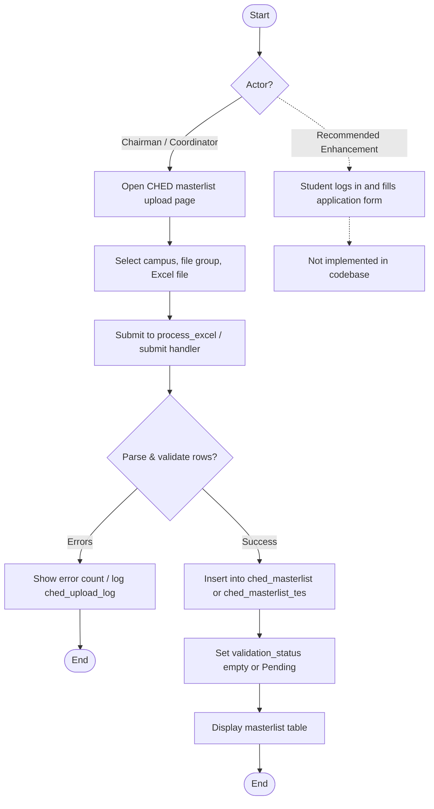

**Suggested Figure Caption:** *Figure 10. Activity diagram of scholarship beneficiary intake via CHED masterlist import (implemented); student self-service application is a recommended enhancement.*

---

## 11. Activity Diagram — Requirements Upload and Verification

**Diagram Type:** Activity Diagram  

**Purpose:** Covers documentary requirements (COR, COG) and validation.

**Description / Meaning:** The **Registrar** uploads COR/COG files into `document_uploads` and the filesystem. **Coordinators** track documents and run **TDP validation** (`validate.php`, `auto_validate_tdp.php`) comparing CHED masterlist fields against `registrar_master_list` and document presence. Validation updates `ched_masterlist.validation_status` to **Validated** or **Failed**. Enrollment/document completeness may be exported via validation remark reports.

**Diagram Code:**
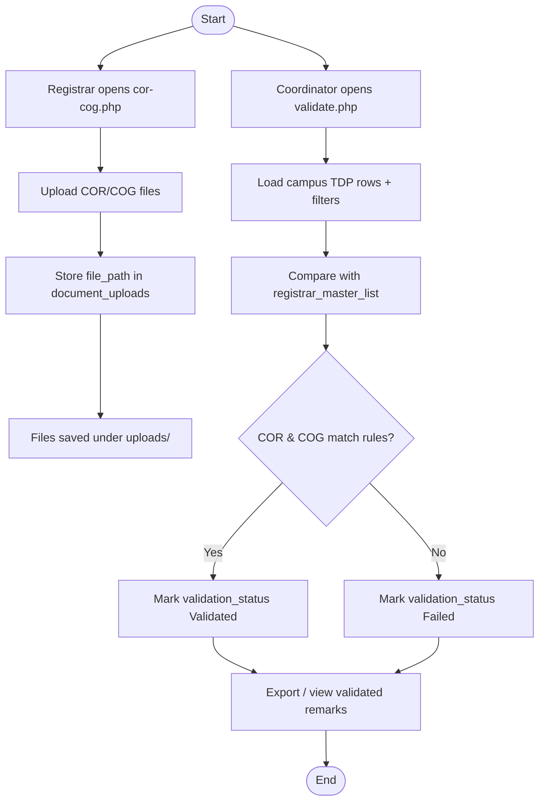

**Suggested Figure Caption:** *Figure 11. Activity diagram of requirements upload by the registrar and verification by the scholarship coordinator.*

---

## 12. Activity Diagram — Application Review and Approval

**Diagram Type:** Activity Diagram  

**Purpose:** Documents review/approval workflows present in the system.

**Description / Meaning:** **Implemented review/approval** includes: (1) **TDP validation** by coordinator; (2) **Annex 7** submission by coordinator (`submit_form.php` / `upload_file.php`) with chairman **approve/reject** (`anex-form2.php`, `update_status.php`); (3) optional **billing** import on verified scholars pages. There is no separate “scholarship application committee” module beyond these flows.

**Diagram Code:**
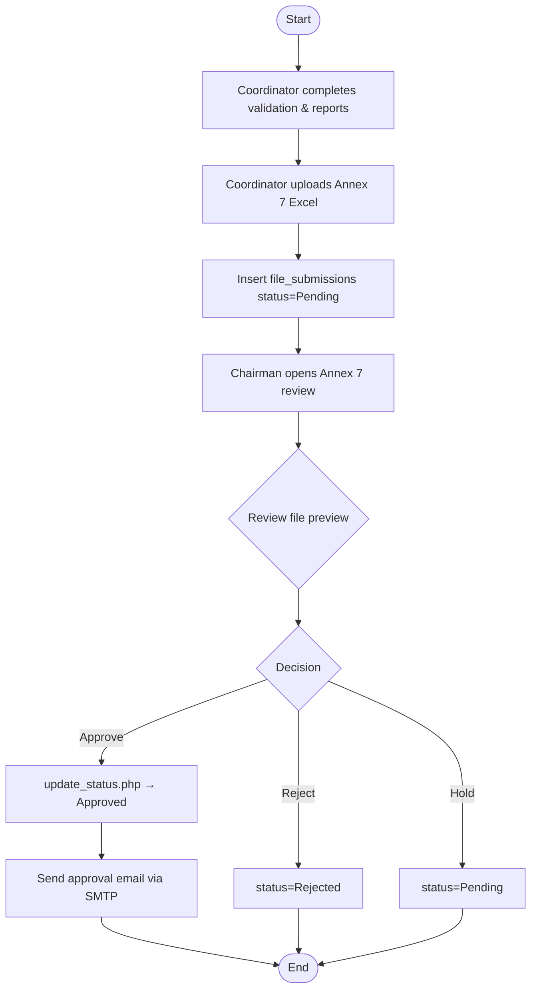

**Suggested Figure Caption:** *Figure 12. Activity diagram of Annex 7 submission and chairman approval in the SchoGMS.*

---

## 13. Sequence Diagram — Login and 2FA

**Diagram Type:** Sequence Diagram  

**Purpose:** Shows temporal interaction for login and verification.

**Description / Meaning:** The sequence involves the browser, PHP login/verify endpoints, MySQL `users` table, and optional SMTP (on account creation, not on every login). Session variables (`user_id`, `role`, `auth_type`) are set before redirecting to the role folder from `schogms_role_home()`.

**Diagram Code:**
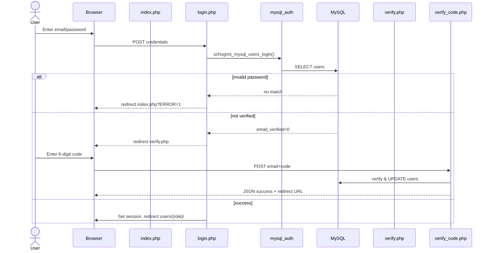

**Suggested Figure Caption:** *Figure 13. Sequence diagram of user login and email verification in the SchoGMS.*

---

## 14. Sequence Diagram — Scholarship Application Submission

**Diagram Type:** Sequence Diagram  

**Purpose:** Shows beneficiary data submission path as implemented.

**Description / Meaning:** **Mapped to CHED masterlist import** (not student portal). Chairman or Coordinator uploads Excel; server parses and inserts rows; upload metadata may be written to `ched_upload_log`.

**Diagram Code:**
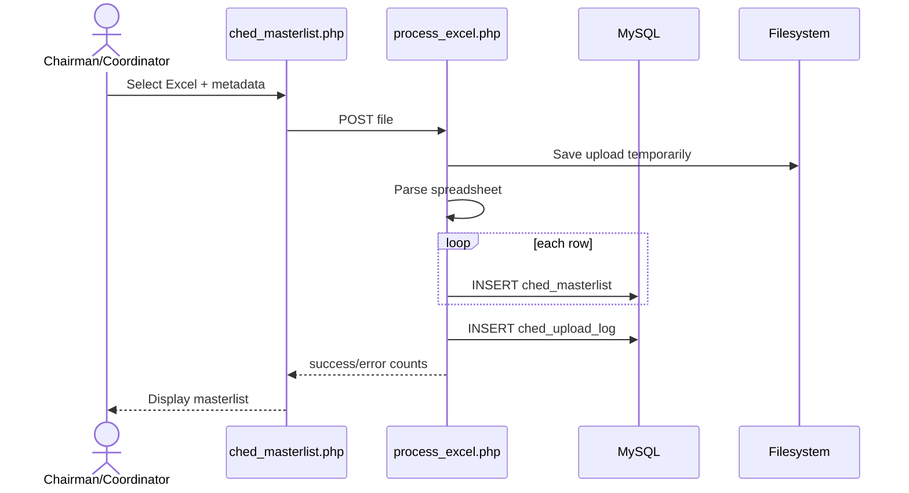

**Suggested Figure Caption:** *Figure 14. Sequence diagram of CHED masterlist import representing scholarship beneficiary registration in the SchoGMS.*

---

## 15. Sequence Diagram — Requirements Review

**Diagram Type:** Sequence Diagram  

**Purpose:** Shows coordinator validation against registrar data and documents.

**Description / Meaning:** Validation requests load filtered TDP rows, join or compare with `registrar_master_list`, check `document_uploads` for name/campus matches, and persist `validation_status`. Bulk validation may use `auto_validate_tdp.php` / `tdp_bulk_validate.php`.

**Diagram Code:**
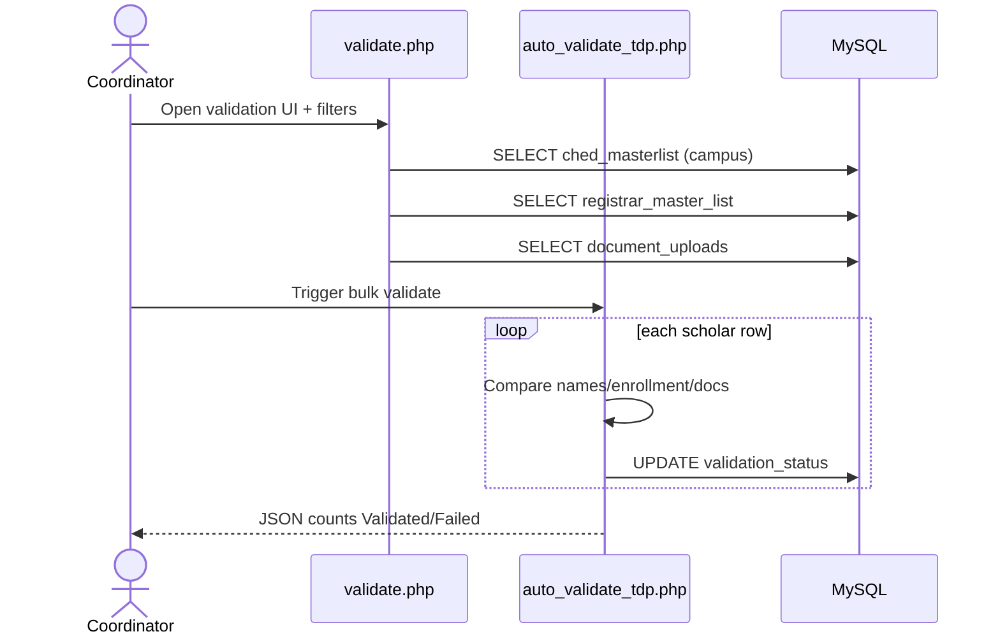

**Suggested Figure Caption:** *Figure 15. Sequence diagram of TDP requirements review and validation by the campus coordinator.*

---

## 16. Sequence Diagram — Application Approval

**Diagram Type:** Sequence Diagram  

**Purpose:** Shows chairman approval of coordinator submissions (Annex 7).

**Description / Meaning:** Chairman updates `file_submissions.status` through `update_status.php`. On **Approved**, the system sends email to the coordinator’s `user_email` using `schogms_send_mail()` and templates from `config/email_templates.php`.

**Diagram Code:**
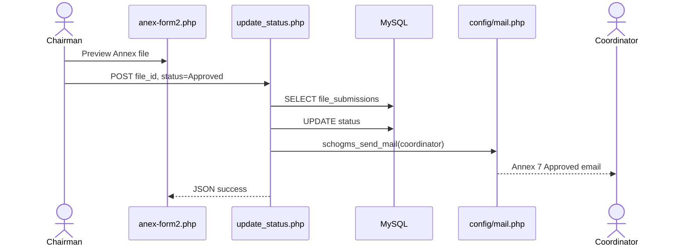

**Suggested Figure Caption:** *Figure 16. Sequence diagram of Annex 7 approval and coordinator notification in the SchoGMS.*

---

## 17. State Diagram — Scholarship Application Status

**Diagram Type:** State Diagram  

**Purpose:** Models status lifecycles for records in SchoGMS.

**Description / Meaning:** Multiple parallel state machines exist: **user accounts** (`pending` → `active`), **Annex 7 files** (`Pending` → `Approved` / `Rejected`), and **TDP validation** (`validation_status`: empty/Pending → `Validated` / `Failed`). A unified “scholarship application” entity does not exist as a single table.

**Diagram Code:**
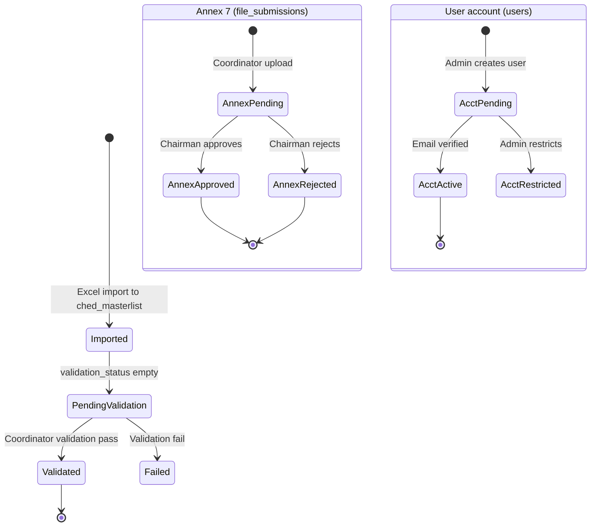

**Suggested Figure Caption:** *Figure 17. State diagram of TDP validation, Annex 7 submission, and user account statuses in the SchoGMS.*

---

## 18. User Role Access Diagram

**Diagram Type:** Role-Based Access Diagram  

**Purpose:** Visualizes which roles access which module groups.

**Description / Meaning:** Access is enforced by **separate portals** (`admin/` vs `users/{role}/`), **session role checks** in `config/session.php`, and **campus/college scoping** (`inc/campus_access.php`). Deans and program chairs authenticate via `assigned_dean` / `assigned_program_chairs` tables in addition to or instead of `users`.

**Diagram Code:**
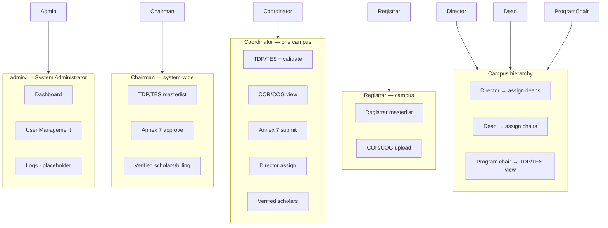

**Suggested Figure Caption:** *Figure 18. Role-based access map of SchoGMS functional modules by user type.*

---

## 19. Sitemap / Navigation Structure Diagram

**Diagram Type:** Sitemap  

**Purpose:** Documents navigable pages per role for screenshots and usability documentation.

**Description / Meaning:** The sitemap follows folder structure under `users/` and `admin/`. Sidebars are defined in role `index.php` and shared `inc/*_nav.php` files (coordinator, registrar). Some legacy PHP pages exist but are omitted from sidebars.

**Diagram Code:**
```mermaid
flowchart TD
  Root[index.php / verify.php]
  Root --> Admin[admin/]
  Admin --> A1[dashboard.php]
  Admin --> A2[user-management.php]
  Admin --> A3[logs.php]

  Root --> Coord[users/coordinator/]
  Coord --> C1[index.php]
  Coord --> C2[ched_masterlist.php]
  Coord --> C3[ched_masterlist_tes.php]
  Coord --> C4[validate.php]
  Coord --> C5[cor-cog.php]
  Coord --> C6[directors.php]
  Coord --> C7[submit_form.php]
  Coord --> C8[verified-scholars.php]

  Root --> Chair[users/chairman/]
  Chair --> H1[index.php]
  Chair --> H2[ched_masterlist.php]
  Chair --> H3[anex-form2.php]
  Chair --> H4[verified-scholars.php]

  Root --> Reg[users/registrar/]
  Reg --> R1[index.php]
  Reg --> R2[masterlist.php]
  Reg --> R3[cor-cog.php]
  Reg --> R4[documents_uploaded.php]

  Root --> Dir[users/director/]
  Dir --> D1[index.php + deans.php]

  Root --> Dean[users/dean/]
  Dean --> DN1[index.php + program chairs]

  Root --> PC[users/program-chair/]
  PC --> P1[tdp.php / tes.php]
```

**Suggested Figure Caption:** *Figure 19. Sitemap of primary SchoGMS navigation paths by role.*

---

## 20. Deployment Diagram

**Diagram Type:** Deployment Diagram  

**Purpose:** Shows physical/logical deployment typical for XAMPP development and institutional hosting.

**Description / Meaning:** SchoGMS is deployed as files under the web root (e.g. `htdocs/SchoGMS`). **Apache** serves PHP. **MySQL** runs locally or on a network server. Uploaded files reside on disk. SMTP may be institutional or a provider configured in `config/smtp.local.php`.

**Diagram Code:**
```mermaid
flowchart TB
  subgraph Client["Client Tier"]
    Browser[Web Browser]
  end

  subgraph Server["Application Server — XAMPP / LAMP"]
    Apache[Apache HTTP Server]
    PHP[PHP Runtime]
    App[SchoGMS PHP Pages]
  end

  subgraph DataTier["Data Tier"]
    MySQL[(MySQL Server)]
    Disk[(File Storage\nuploads/)]
  end

  subgraph Net["Network"]
    SMTP[SMTP Server]
  end

  Browser --> Apache
  Apache --> PHP
  PHP --> App
  App --> MySQL
  App --> Disk
  App --> SMTP
```

**Suggested Figure Caption:** *Figure 20. Deployment diagram of the SchoGMS on an Apache/PHP/MySQL stack.*

---

## 21. Component Diagram

**Diagram Type:** Component Diagram  

**Purpose:** Groups related PHP components and shared libraries.

**Description / Meaning:** Components are **coarse-grained PHP modules** rather than Composer packages (except PhpSpreadsheet for Excel). Shared configuration lives in `config/`; cross-role logic in `inc/`.

**Diagram Code:**
```mermaid
flowchart TB
  subgraph WebUI["Web UI Components"]
    AdminUI[admin module]
    CoordUI[coordinator module]
    ChairUI[chairman module]
    RegUI[registrar module]
    DirUI[director module]
    DeanUI[dean module]
    PCUI[program-chair module]
  end

  subgraph Core["Core Services"]
    Auth[login.php + mysql_auth.php]
    Verify[inc/verify_account.php]
    Mail[config/mail.php]
    Helpers[schogms_helpers.php]
    CampusAccess[inc/campus_access.php]
  end

  subgraph DataAccess["Data Access"]
    MySQLConn[config/schogms_mysql.php]
    MongoLegacy[conn_mongodb.php]
  end

  subgraph Integrations["Integrations"]
    PhpSpreadsheet[PhpSpreadsheet — Excel]
    DataTables[DataTables / Chart.js — UI]
  end

  AdminUI --> Auth
  CoordUI --> Auth
  ChairUI --> Auth
  RegUI --> Auth
  CoordUI --> CampusAccess
  CoordUI --> PhpSpreadsheet
  ChairUI --> PhpSpreadsheet
  Auth --> MySQLConn
  Verify --> MySQLConn
  CoordUI --> MongoLegacy
  Mail --> SMTPExt[SMTP]
```

**Suggested Figure Caption:** *Figure 21. Component diagram of SchoGMS PHP modules and shared services.*

---

## 22. Report Generation Flow Diagram

**Diagram Type:** Process Flow / Data Flow  

**Purpose:** Describes how reports and exports are produced.

**Description / Meaning:** Reports are generated by **exporting SQL result sets** to Excel/CSV via PhpSpreadsheet or dedicated export scripts (`validated_remarks.php`, `validated_remarks_tes.php`, coordinator `data/masterlist_exports/`, chairman download templates). Charts on dashboards use `fetch_chart.php` endpoints. There is no separate reporting server.

**Diagram Code:**
```mermaid
flowchart LR
  A[User opens validation or masterlist page]
  B[Apply filters — campus, category, status]
  C[SQL query ched_masterlist + joins]
  D{Output format?}
  E[On-screen DataTable]
  F[PhpSpreadsheet Excel export]
  G[CSV masterlist_exports]
  H[Dashboard chart JSON fetch_chart.php]

  A --> B --> C
  C --> D
  D --> E
  D --> F
  D --> G
  C --> H
```

**Suggested Figure Caption:** *Figure 22. Report generation flow from filtered queries to on-screen tables, Excel exports, and dashboard charts in the SchoGMS.*

---

## 23. Notification Flow Diagram

**Diagram Type:** Process Flow  

**Purpose:** Shows when the system sends email notifications.

**Description / Meaning:** Email is used for **account verification** (new user), **Annex 7 approval** (chairman → coordinator), and **role assignment** templates in `config/email_templates.php`. Delivery depends on SMTP configuration; failures are logged via `schogms_log_error()`. There is **no in-app notification center** (**Recommended Enhancement**).

**Diagram Code:**
```mermaid
flowchart TD
  T1[Admin creates user] --> M1[Generate verification_code]
  M1 --> E1{SMTP configured?}
  E1 -->|Yes| Mail1[Send welcome/verification email]
  E1 -->|No| N1[Needs Verification — manual code]

  T2[Chairman approves Annex 7] --> M2[update_status.php]
  M2 --> Mail2[schogms_send_mail to coordinator]

  T3[Dean/Director assigns role] --> M3[Assignment email templates]
  M3 --> Mail3[Optional SMTP send]

  Mail1 --> Log[error_log / schogms_log_error on failure]
  Mail2 --> Log
  Mail3 --> Log
```

**Suggested Figure Caption:** *Figure 23. Notification flow for email-based alerts in the SchoGMS.*

---

## 24. Audit Trail / Logging Flow Diagram

**Diagram Type:** Process Flow  

**Purpose:** Documents logging and audit mechanisms.

**Description / Meaning:** Implemented logging includes **`verification_attempts`** (failed/successful verification tries), **`ched_upload_log`** (bulk upload statistics), and **PHP `error_log`** via `schogms_log_error()` and `config/error_handler.php`. The **admin logs UI** currently displays **static sample rows** — a dedicated `audit_log` table was **not found** (**Needs Verification** / **Recommended Enhancement**).

**Diagram Code:**
```mermaid
flowchart TD
  subgraph Events["Auditable Events"]
    E1[Login failure]
    E2[Verification attempt]
    E3[Excel masterlist upload]
    E4[Annex status change]
    E5[PHP/runtime errors]
  end

  subgraph Stores["Implemented Stores"]
    V1[(verification_attempts)]
    V2[(ched_upload_log)]
    V3[(PHP error_log file)]
  end

  subgraph UI["Admin UI"]
    L1[admin/logs.php — placeholder sample data]
  end

  E2 --> V1
  E3 --> V2
  E5 --> V3
  E1 --> V3
  E4 --> V3

  V1 -.->|Recommended Enhancement| L2[Unified audit_log table + UI]
  L1 -.-> NeedsVerification[Needs Verification]
```

**Suggested Figure Caption:** *Figure 24. Audit and logging flow in the SchoGMS, including verification attempts, upload logs, and error logging.*

---

## Appendix A — Mapping Paper Terminology to Implementation

| Paper / generic term | SchoGMS implementation |
|----------------------|-------------------------|
| Scholarship application | CHED TDP/TES masterlist row + validation |
| Application submission | Excel import / registrar masterlist upload |
| Requirements upload | COR/COG → `document_uploads` |
| Application review | `validate.php`, remarks exports |
| Application approval | Annex 7 `file_submissions` + chairman `update_status.php` |
| Student portal | **Not implemented** |
| Profile management | Limited; `change_password.php` on some roles |
| Audit logs | Partial; admin logs UI is placeholder |

---

## Appendix B — Rendering Diagrams

- **Mermaid:** VS Code, GitHub, [mermaid.live](https://mermaid.live), or Pandoc with mermaid filter.
- **PlantUML:** Use for Figure 2 (Use Case); [plantuml.com](https://www.plantuml.com/plantuml).

---

*End of diagram set — aligned with SchoGMS codebase as of documentation review.*
