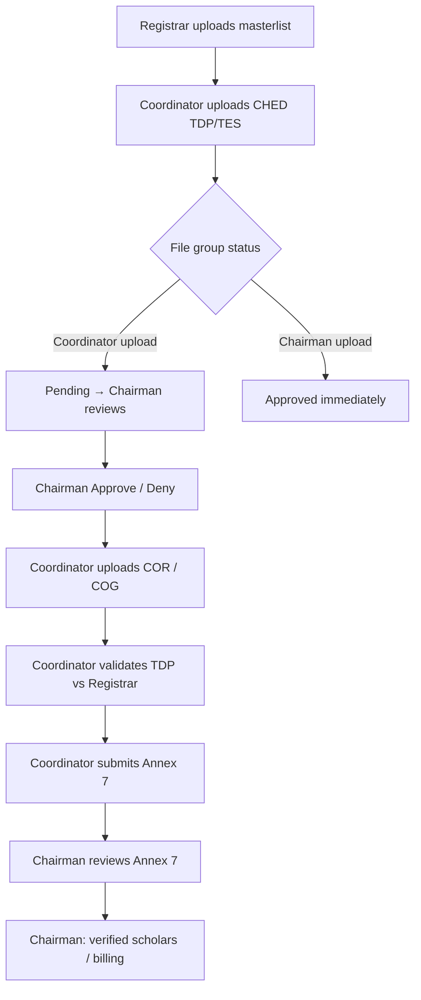

# SchoGMS — How uploads work (step by step)

This guide explains **what each upload does**, **what happens in the system**, and **what you do next**. It matches the current codebase (MySQL masterlists, file group approval, COR/COG matching).

**Demo files:** [`demo/DEMO_GUIDE.md`](../demo/DEMO_GUIDE.md) and [`demo/files/`](../demo/files/)  
**Demo logins:** [`demo/ACCOUNTS.md`](../demo/ACCOUNTS.md)

---

## 1. Big picture

Scholarship data moves through the campus in a fixed order. Later steps depend on earlier ones.



| Layer | What it stores | Who usually uploads |
|-------|----------------|-------------------|
| **Registrar masterlist** | Official enrolment (name, course, year, ID, etc.) | Registrar (or Chairman via MySQL import) |
| **CHED masterlist** | Grantee list from CHED (TDP or TES) | Coordinator or Chairman |
| **File group batch** | Approval state for one CHED batch name | Auto-created on CHED upload |
| **Document uploads** | COR / COG PDFs linked to campus + file group | Coordinator or Registrar |
| **File submissions** | Annex 7 utilization reports | Coordinator |
| **Billing** | Payment / OR data for verified scholars | Chairman (import) |

---

## 2. Roles (who does what)

| Role | Main uploads | Main reviews |
|------|----------------|--------------|
| **Registrar** | Campus registrar masterlist; may upload COR/COG | — |
| **Coordinator** | CHED TDP/TES, COR, COG, Annex 7 | Validates TDP vs registrar |
| **Chairman** | CHED TDP/TES (system-wide), registrar masterlist (MySQL), billing | **File groups** (approve/deny), Annex 7, program list |
| **Director** | Creates directors/deans (no masterlist file) | Assigns deans |
| **Dean** | Assigns program chairs | — |
| **Program chair** | — | Views TDP/TES counts for one program |

All coordinators are scoped to **one campus** (e.g. ACCESS). Chairman sees **all campuses**.

---

## 3. Step-by-step workflow

### Step 0 — Log in

1. Open `index.php`.
2. Enter email/username and password.
3. If the account is **pending**, complete email verification on `verify.php` first.
4. You land on the dashboard for your role.

**Next:** Start with registrar data (Step 1) for a full validation demo.

---

### Step 1 — Registrar masterlist upload

| | |
|--|--|
| **Who** | Registrar (campus account) |
| **Where** | Registrar → **Masterlist** → Upload |
| **File** | Excel/CSV with columns: Last name, First name, Middle name, ID, Course, Year level, Enrolled, etc. |
| **You enter** | **File group** (batch label), **Academic year**, **Semester** |
| **Example file group** | `DEMO PRESENT \| Registrar ACCESS SY 2024-2025` |

**What happens when you upload**

1. The file is saved under `users/registrar/uploads/`.
2. Each row is stored in **`registrar_master_list`** (MySQL) *or* MongoDB depending on your server setup — **TDP validation uses MySQL** `registrar_master_list`.
3. Scholars are keyed by **campus + name** (last, first, middle).

**What you should see**

- Masterlist table filled with students for that campus and file group.

**Next step**

- Coordinator uploads **CHED TDP** (Step 2) using the **same campus** and names that align with registrar rows.

**Tip:** If validation later shows “no registrar match”, names or campus must match between registrar and CHED files.

---

### Step 2 — Coordinator CHED TDP masterlist upload

| | |
|--|--|
| **Who** | Coordinator |
| **Where** | Coordinator → **CHED TDP Masterlist** → Upload |
| **File** | CHED Excel template (columns from row with **SEQ** — typically A=SEQ, B=APP NO, D=LASTNAME, E=FIRSTNAME, …) |
| **You enter** | **File group** (required), e.g. `DEMO PRESENT \| TDP ACCESS SY 2024-2025` |
| **Example file** | `demo/files/02_coordinator/ched_tdp_ACCESS_SY2024-2025_demo.xlsx` |

**What happens when you upload**

1. PhpSpreadsheet reads the sheet; data rows are inserted into **`ched_masterlist`** (`sheet_name` = your campus).
2. Each row stores: seq, app/award numbers, names, course, year level, units, enrollment status, remarks, **filename**, **file_group**.
3. The upload registers a **file group batch** in **`schogms_file_group_batches`** with status **`pending`**.
4. **Notifications:** active chairmen get an in-app bell alert; email is sent if SMTP is configured.
5. The uploaded Excel file on disk is **deleted** after import (only DB rows remain).

**What you should see**

- Success message with row count.
- New rows on CHED TDP Masterlist filtered by your file group.
- Chairman sees the batch under **Review → File groups → Pending**.

**Next step**

- **Chairman approves** the file group (Step 3), **or** continue campus work while waiting.
- You **cannot** match COR reliably until TDP rows exist (Step 4).

---

### Step 3 — Chairman file group review (approve / deny)

| | |
|--|--|
| **Who** | Chairman |
| **Where** | Chairman → **Review → File groups** |
| **Tabs** | TDP / TES; filters: Pending, Approved, Denied |
| **Actions** | Approve, Deny, Edit notes, Delete batch (where enabled) |

**What happens when chairman approves**

1. `schogms_file_group_batches.status` → **`approved`**.
2. Reviewer name and time are saved.
3. **Notifications + email** go to the **uploader** (coordinator) that the batch was approved.
4. If denied, status → **`denied`**; coordinator is notified.

**Special case — Chairman uploads CHED**

- Chairman TDP/TES upload sets the batch to **`approved`** immediately (no pending queue).

**Next step**

- Coordinator uploads **COR** and **COG** (Steps 4–5).
- Optional: open **Program list** to see campuses/programs and who uploaded each batch.

---

### Step 4 — Coordinator COR upload

| | |
|--|--|
| **Who** | Coordinator |
| **Where** | Coordinator → **COR** → **Bulk upload COR** (or COR & COG bulk page) |
| **Files** | PDF, JPG, or PNG — **one file per scholar** |
| **You enter** | **File group** (e.g. `DEMO PRESENT \| COR ACCESS SY 2024-2025`) |
| **Example files** | `demo/files/03_cor_cog/COR/*.pdf` |

**File naming rule (important)**

The system matches the **filename** (without extension) to a scholar on the **TDP + TES masterlist** for your campus:

| Correct | Wrong |
|---------|--------|
| `REYES, MARIA SANTOS.pdf` | `MARIA REYES.pdf` |
| `DELA CRUZ, JUAN TORRES.pdf` | `juan_delacruz.pdf` |

Format: **`Lastname, Firstname Middlename`** (same as generated COR basename from masterlist).

**What happens when you upload**

1. API: `submit_document_cor_cog.php` builds a name index from `ched_masterlist` + `ched_masterlist_tes`.
2. For each file:
   - **Match found** → old COR for that name is removed; file saved under `users/coordinator/uploads/COR/`; row inserted in **`document_uploads`**.
   - **No match** → file listed as **rejected** (not on masterlist).
   - **DB error** (e.g. file group too long) → listed under **errors**.
3. Response JSON shows accepted / rejected / errors counts.

**What you should see**

- Toast/summary: “X file(s) saved for Y scholar(s)”.
- COR list table with file group and upload time.

**Next step**

- Upload **COG** (Step 5), then run **Validate TDP** (Step 6).

---

### Step 5 — Coordinator COG upload

Same as Step 4, but:

- **Where:** Coordinator → **COG** → Bulk upload  
- **Category:** COG  
- **Folder:** `users/coordinator/uploads/COG/`  
- **Example:** `demo/files/03_cor_cog/COG/*.pdf`

Validation (Step 6) can check whether COR/COG exist for each scholar.

---

### Step 6 — Validate TDP (coordinator)

| | |
|--|--|
| **Who** | Coordinator |
| **Where** | Coordinator → **Validate TDP** (and related remarks / export pages) |
| **Upload?** | **No file** — this is a **compare** step |

**What the system checks (per scholar)**

1. **Registrar match** — same last/first/middle name on `registrar_master_list` for the campus.
2. **Course match** — CHED course vs registrar course (normalized comparison).
3. **Year level match** — CHED year vs registrar year.
4. **COR / COG** — whether `document_uploads` has files for that name (informational on some screens).

**What happens when you run bulk validate**

- Each TDP row gets `validation_status` = **`Validated`** or **`Failed`** in `ched_masterlist`.

**What you should see**

- Pass/fail counts; rows highlighted on Validate / Validated masterlist pages.

**Next step**

- Fix failed rows (edit masterlist, fix registrar data, or upload missing COR).
- Submit **Annex 7** (Step 7).

---

### Step 7 — Coordinator Annex 7 (Submit form)

| | |
|--|--|
| **Who** | Coordinator |
| **Where** | Coordinator → **Submit Form** |
| **File** | Excel/CSV (Annex 7 utilization template) |
| **Handler** | `upload_file.php` → table **`file_submissions`** |

**What happens when you upload**

1. File stored under coordinator uploads (Annex path).
2. Row inserted with status **`Pending`**.
3. Chairman reviews on Annex / submission screens (approve/reject — separate from file group batches).

**Next step**

- Chairman reviews submission status (Step 8).

---

### Step 8 — Chairman Annex 7 & program oversight

| | |
|--|--|
| **Who** | Chairman |
| **Where** | Annex 7 review pages, **Program list** (TDP/TES tabs, campus filters), **Verified scholars** |

No new masterlist upload required unless importing billing.

**Next step**

- **Verified scholars / billing import** (Step 9), if your deployment uses `billing_table`.

---

### Step 9 — Chairman billing / verified scholars (optional)

| | |
|--|--|
| **Who** | Chairman |
| **Where** | Chairman → Verified scholars → import (if enabled) |
| **File** | Excel with payment columns |
| **Example** | `demo/files/04_chairman/billing_verified_scholars_ACCESS_demo.xlsx` |

**What happens**

- Rows stored in **`billing_table`** (when the table exists), often keyed by name, campus, OR number.

---

### Parallel track — CHED TES

| Step | Same as TDP but |
|------|------------------|
| Upload | Coordinator → **CHED TES Masterlist** |
| Table | `ched_masterlist_tes` |
| File group | e.g. `DEMO PRESENT \| TES ACCESS SY 2024-2025` |
| File group approval | TES batches also use `schogms_file_group_batches` when registered |
| Validate | **Validate TES** pages |
| COR/COG | Same filename rules; index includes TES names |

You can demo TES after TDP or alone; COR matching uses both lists when scope is “all”.

---

## 4. File group naming rules

| Rule | Detail |
|------|--------|
| **Required** | Every CHED and COR/COG upload must include a **file group** label. |
| **Max length** | 512 characters (system widens DB column automatically on first use). |
| **Uniqueness** | One batch = one label per campus + program (TDP/TES). |
| **Coordinator TDP** | Creates **pending** batch → chairman must approve. |
| **Chairman TDP/TES** | Creates **approved** batch immediately. |

Use consistent labels across steps, e.g.:

- `DEMO PRESENT | TDP ACCESS SY 2024-2025` — masterlist  
- `DEMO PRESENT | COR ACCESS SY 2024-2025` — COR files (can differ from TDP label; filtering is by file group column)

---

## 5. Notifications and email

| Event | Who gets notified |
|-------|-------------------|
| Coordinator uploads TDP/TES (pending) | All active **chairmen** (bell + email) |
| Chairman approves / denies | **Uploader** (coordinator) |
| Coordinator waiting on review | Optional “waiting” message to uploader on submit |

Email requires SMTP in `config/smtp.local.php`. In-app notifications work without email.

---

## 6. Quick troubleshooting

| Symptom | Likely cause | Fix |
|---------|--------------|-----|
| COR “not on masterlist” | TDP not uploaded or wrong filename | Upload Step 2 first; use `Lastname, Firstname Middlename.pdf` |
| “File group is required” | Empty file group field | Paste batch name from demo guide |
| “Database insert failed” / file group | Label too long (old DB) | Shorten label or reload page to run schema fix |
| Validation always failed | No registrar row or course/year mismatch | Step 1 registrar upload; align names and course/year |
| Chairman sees no pending | Batch already approved or wrong program tab | Check TDP tab; filter Pending |
| Upload request failed | PHP error (check Network tab) | See `users/coordinator/error_log.txt` |

---

## 7. Recommended demo order (with files)

Use this order for a live presentation:

1. **Registrar** → `demo/files/01_registrar/registrar_masterlist_ACCESS_demo.xlsx`  
2. **Coordinator** → `02_coordinator/ched_tdp_ACCESS_SY2024-2025_demo.xlsx`  
3. **Chairman** → File groups → **Approve** (no file)  
4. **Coordinator** → `03_cor_cog/COR/*.pdf` then `03_cor_cog/COG/*.pdf`  
5. **Coordinator** → Validate TDP  
6. **Coordinator** → `02_coordinator/annex7_ACCESS_demo.xlsx`  
7. **Chairman** → Review Annex / program list / optional billing file  

Full table: [`demo/DEMO_GUIDE.md`](../demo/DEMO_GUIDE.md).

---

## 8. Prepare data before a demo

```bash
# Presentation kit (manual uploads, 5 scholars)
/Applications/XAMPP/xamppfiles/bin/php tools/build_demo_package.php

# OR large auto-filled database (screenshots)
/Applications/XAMPP/xamppfiles/bin/php tools/seed_demo_data.php --light
```

---

## 9. Related technical docs

- System pages per role: [`SchoGMS_System_Documentation.md`](SchoGMS_System_Documentation.md)  
- Auto seed details: [`../tools/README_DEMO_SEED.md`](../tools/README_DEMO_SEED.md)  
- File group meta code: [`../inc/schogms_file_group_meta.php`](../inc/schogms_file_group_meta.php)  
- COR matching code: [`../users/coordinator/inc/cor_cog_upload_helpers.php`](../users/coordinator/inc/cor_cog_upload_helpers.php)
